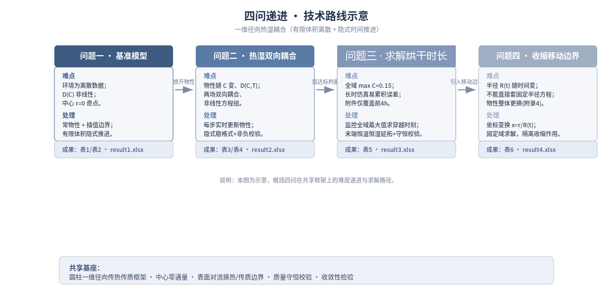
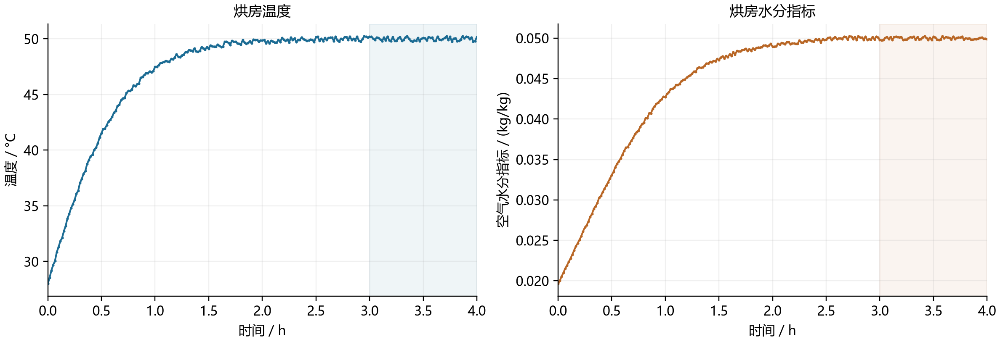
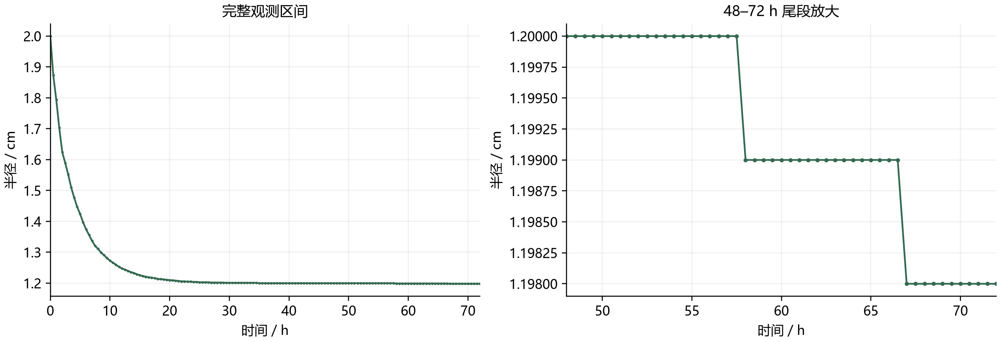

## 摘要

本文针对长 25 cm、半径 2 cm 的圆柱形药材，建立**轴对称一维径向热湿耦合偏微分方程模型**：傅里叶导热定律描述热量传递，干基菲克扩散本构描述水分迁移，由质量守恒导出含水率演化方程；第四问的收缩几何用材料坐标变换映射为固定计算域。空间离散用**守恒型节点对偶有限体积**与 **Kirchhoff 浓度势**（精确积分强非线性含水率），时间推进用**变阶变步长隐式 BDF/NDF** 与**解析稀疏 Jacobian**，达标时刻由**空间最大含水率的阈值事件**定位。

四问共用该模型，仅切换物性与判据：问题一取附录 2 常热物性、热湿解耦；问题二全程用附录 3 变物性、双向耦合；问题三复用问题二的解，以"空间最大含水率严格低于 0.15 kg/kg"求烘干时长；问题四改用附录 4 物性并叠加附件 2 的半径收缩。

主要结果：（1）1800 s 时表面温度 36.7856 °C、中心 33.5753 °C，表面含水率由 2.5500 降至 1.5102 kg/kg，距中心 1 cm 以内基本不变，即 30 min 内水分变化仅局限于表层；热、水扩散率之比约 34.2。（2）3 h 时表面温度 49.9664 °C、中心与表面仅差 0.1169 °C，含水率仍相差 0.7581 kg/kg，已进入内扩散控制的恒温干燥阶段。（3）附录 3 物性、固定半径下，全域含水率首次严格低于 0.15 kg/kg 的时间为 **57.4724 h（约 2.39 天）**。（4）计入附件 2 半径收缩并用附录 4 物性后为 **51.0906 h（约 2.13 天）**；同物性对照表明收缩使达标时间由约 129.85 h 缩至约 51.09 h（约 60.7%），故两问时长差不能全部归因于收缩。

模型修正与创新：题给密度经验式与“给定半径轨迹 + 固定长度 + 严格干物质守恒”不能同时精确成立，本文给出有效热物性闭合；表面汽化耗能按潜热比例作情景包络；水分通量用 Kirchhoff 浓度势处理；移动边界用材料坐标与干骨架守恒处理；并由附件 1 湿度观测反推水活度锚点，构造吸附闭合情景族。

稳健性与检验：达标时间由两族隐式积分器（BDF/NDF、Radau IIA）与两种水通量面离散格式在三档网格上一致到 $10^{-6}$ s，阈值事件两种定位法相差 $5.8\times10^{-11}$ s，收缩使时长缩短 60.7% 由 $(R_0/R(t))^2$ 尺度折算印证到 1.37% 以内，三阶段分界由四种判据识别于同一区间，故 57.4724 h 与 51.0906 h 非特定网格、求解器或判据的产物。解析解对照最大温度偏差（节点口径）$1.80\times10^{-6}$ K，离散质量恒等式残差约 $10^{-14}$ kg/kg。题目未提供内部实测，结果为所列假设下的**条件性预测**，不对准确率、实测误差或时长置信区间作声明；4 h 后的环境历程占报告时长的 92%—93%，其平台延拓是主要不确定性来源。

**关键词**：热湿耦合；圆柱非稳态扩散；有限体积法；材料坐标变换；全域达标时间

---

# 1　问题重述

## 1.1　问题背景

中药材热风烘干含预热平衡与恒温干燥两个阶段，参数选取不当会造成效率低、能耗高、品质不稳定；用数值仿真揭示内部温度与水分的演化规律有实际意义。

## 1.2　问题提出

药材长 25 cm、半径 2 cm，初始温度 28 °C、干基含水率 2.55 kg/kg；烘房环境由**附件 1** 给出，物性经验式问题一见**附录 2**、问题二三见**附录 3**、问题四见**附录 4**。

**问题一（预热平衡阶段）** 建立预热平衡阶段的温度与水分浓度模型（参数见附录 2）；按表 1、表 2 格式给出 100、300、600、900、1200、1500、1800 s 共 7 个时刻、到中心距离 0、0.5、1、1.5、2 cm 共 5 个位置的温度（°C）与水分浓度（kg/kg），1800 s 内**每隔 1 s**、**每隔 0.1 cm** 的完整结果存入 `result1.xlsx`。

**问题二（全过程热湿耦合）** 全过程 2—3 天且两阶段参数不同，经验公式统一采用附录 3；按表 3、表 4 格式给出 3 h 内每隔 0.5 h、径向 0、0.5、1、1.5、2 cm 处的结果，完整结果按**每隔 1 s**、**每隔 0.1 cm** 存入 `result2.xlsx`。

**问题三（全域达标与烘干时长）** 要求**各处**水分浓度低于 0.15 kg/kg，据此求烘干时间（h）；按表 5 格式给出每隔 6 h、径向每隔 0.5 cm 的水分浓度，完整结果按**每隔 60 s**、**每隔 0.1 cm** 存入 `result3.xlsx`。

**问题四（尺寸变化下的烘干时长）** 依据**附件 2** 的半径变化数据与附录 4 经验公式建立含尺寸变化的模型并重新确定烘干时长；按表 6 格式给出每隔 6 h、径向每隔 0.5 cm 的水分浓度，完整结果按**每隔 60 s**、**每隔 0.1 cm** 存入 `result4.xlsx`。

**结果输出要求** 正文按表 1—表 6 格式给出结果，完整结果存入 `result1.xlsx`—`result4.xlsx`（模板见附件 3），**所有结果保留四位小数**；四问的输入输出要求见表 7。

**表 7　四个问题的输入条件、模型增量与输出要求**

| 问题 | 输入与模型增量 | 正文需给出的结果 | 结果文件 |
|---|---|---|---|
| 问题一 | 圆柱尺寸与均匀初值；附件 1 环境温湿度；附录 2 物性 | 1800 s 内 7 个时刻 × 5 个半径的温度（表 9）与水分浓度（表 10） | `result1.xlsx` |
| 问题二 | 同一初值；经验公式改为附录 3，物性随含水率与温度变化，覆盖全过程 2—3 天 | 3 h 内每隔 0.5 h × 5 个半径的温度（表 15）与水分浓度（表 16） | `result2.xlsx` |
| 问题三 | 沿用问题二的模型，施加"各处水分浓度 < 0.15 kg/kg"的达标判据 | 每隔 6 h、每隔 0.5 cm 的水分浓度（表 20）及烘干所需时间 | `result3.xlsx` |
| 问题四 | 改用附录 4 物性；由附件 2 引入半径随时间的变化 | 每隔 6 h、每隔 0.5 cm 的水分浓度（表 22）及新的烘干时长 | `result4.xlsx` |

---

# 2　问题分析

## 2.1　总体性质与主要难点

本题为传热传质机理建模问题：$T(r,t)$、$C(r,t)$ 由傅里叶导热定律与菲克扩散定律驱动，经表面对流换热、对流传质与烘房环境耦合；四问核心都是**偏微分方程定解问题**，问题三、四为**阈值事件定位**（空间最大含水率首次严格低于 0.15 kg/kg 的时刻）。难点有四：**（1）热湿时间尺度差一至两个数量级**——热扩散约 0.7—1.4 h、水分扩散约 20—106 h，刚性比 25—75，须隐式推进；**（2）两阶段不能由一条常系数模型贯穿**——全过程 2—3 天且参数不同，需变物性统一模型；**（3）问题一可解耦、问题二起必须联立**；**（4）问题四求解域随时间缩小且环境数据仅覆盖 4 h**（半径由 2 cm 收缩至约 1.2 cm）。

## 2.2　数据条件与数据边界

**附件给出的是边界驱动与几何，不是药材内部的温度或含水率观测**，故本文结果为明确假设下的条件性预测（表 8）。

**表 8　数据条件与模型可用边界**

| 数据 | 内容 | 覆盖范围 | 可直接支撑 | 必须额外引入的约定 |
|---|---|---|---|---|
| 附件 1 | 烘房温度与水分浓度，241 条 | 0—4 h，每 60 s | 已记录时刻的环境边界 | 点间线性插值；4 h 后按平台延拓 |
| 附件 2 | 药材表面半径，145 条 | 0—72 h，每 1800 s | 表面位置 $R(t)$ | 点间线性插值；内部"同比收缩" |
| 附录 2—4 | 物性与扩散系数经验式共 9 条 | 全时段 | 给定状态下的系数 | 无独立系数误差、无拟合区间 |
| 附件 3 | 结果模板 | — | 输出格式（时间为行、距离为列） | — |
| 未提供 | 内部温度、内部含水率、称重曲线、长度变化、吸附等温线 | — | **不能直接验证内部响应** | 内部场全部由模型预测 |

由此得三条结论：① 问题三、四的报告时长分别有 **93.0%** 与 **92.2%** 落在附件 1 的 4 h 观测窗之外；② 问题四的达标时刻 51.09 h 在附件 2 的 72 h 观测范围内，**不需半径外推**；③ 附件 1 水分浓度的参考质量基准未注明（空气干基与药材干基分母不同），将其视为等效平衡含水率是**显式约定**，非物理等价。

## 2.3　建模的定量依据：量级分析先行

取 $C_0=2.55$、$T_0=301.15$ K、$R_0=0.02$ m，定义 $\alpha=k/(\rho_{\text{eff}}c_p)$、$D$、$Bi_h=hR_0/k$、$Bi_m=\beta R_0/D$，结果见表 12（第 5 节）。① **$Bi_h\sim 1$**：不能近似为瞬时等温的集中参数体，须解内部温度梯度，故用 PDE 模型；② **$\alpha/D\approx 26$—$75$**：热量传递远快于水分迁出；③ **水分扩散特征时间 19.7—106.1 h 与烘干时长同量级**：过程由**内部水分扩散控制**。

## 2.4　环境驱动的可用性

问题二至四的时间跨度远大于附件 1 的观测窗，故约定：0—4 h 按 60 s 观测点分段线性插值，4 h 后取末段平台（50 °C 与 0.05 kg/kg）作基准延拓，并比较末值保持、末段均值保持与平台扰动情景；插值是驱动条件的**重采样**而非新观测，平台延拓是**模型假设**（第 13 节）。附件 1 末段（3—4 h）已接近平台，末点 50.165 °C 与 0.04986 kg/kg，拼接跳变仅 −0.165 °C 与 +0.00014 kg/kg。

## 2.5　问题一：可解耦的短时基线

问题一为常热物性，温度方程可独立求解，含水率方程只通过 $D(C)$ 非线性；固定半径、常物性、恒定环境下圆柱温度场存在 **Bessel 级数解析解**，可用于检验离散求解器，故问题一定位为"可验证的短时基线"。

## 2.6　问题二：从解耦到双向耦合

问题二覆盖全过程（2—3 天），经验公式统一采用附录 3。此时 $\rho$、$c_p$、$k$ 依赖 $C$，$D$ 依赖 $C$ 与 $T$，两方程互为输入、必须联立求解；$D$ 的温度项为 Arrhenius 形式，温度须换算为**开尔文**代入。

## 2.7　问题三：全域判据与阈值事件

问题三在问题二的解上施加烘干判据。因要求"药材**各处**水分浓度均低于 0.15 kg/kg"，须取**空间最大值**判定（式 (77)），不能用中心点值或平均值代替（后期中心与表面可相差近三倍）；且"严格小于"与四位小数显示存在口径问题（显示 0.1500 不能证明严格达标），须以**未舍入**判定值为准。

## 2.8　问题四：移动边界与收缩净效应

求解域 $0\le r\le R(t)$ 随时间缩小，属**移动边界问题**。本文取材料坐标 $x=r/R(t)$ 把移动域映射为固定域 $[0,1]$，$x=1$ 始终是真实表面，几何收缩以 $1/R(t)^2$ 进入扩散算子，即**半径减小会加快内部迁移**（第 5 节式 (26)—(28)）。两处易重复计入的项须注意：**不应加体积浓缩项**（$C$ 为水与干物质之比），**不应再叠加网格平流项**（已用材料坐标）。问题四相对问题三同时改变物性与几何，故补充"同附录 4 物性、固定半径与收缩"的对照（第 9.5 节）。

## 2.9　总体建模思路与技术路线

本文建立**统一的轴对称一维径向热湿耦合模型**：

$$
B(C)\frac{\partial T}{\partial t}=\frac{1}{R(t)^{2}x}\frac{\partial}{\partial x}\left(x\,k(C)\frac{\partial T}{\partial x}\right),
\qquad
\frac{\partial C}{\partial t}=\frac{1}{R(t)^{2}x}\frac{\partial}{\partial x}\left(x\,D(C,T)\frac{\partial C}{\partial x}\right)
\tag{1}
$$

式 (1) 中 $x=r/R(t)$ 为材料径向坐标，$R(t)\equiv R_0$ 时退化为固定半径形式，故该式为四问通用控制方程。四问只在同一框架内切换**物性来源**（附录 2→3→4）、**几何**（固定半径或 $R(t)$）与**判据**（是否施加 $M(t)<0.15$）；求解用守恒型有限体积配合隐式时间推进，验证按"解析基准 → 离散守恒 → 收敛 → 跨实现对照"分层报告（表 13、图 1）。

**表 13　四问的模型切换与技术路线**

| 问题 | 物性 | 几何 | 求解与判据 | 验证要点 |
|---|---|---|---|---|
| 一 | 附录 2（常热物性，$D$ 仅依赖 $C$） | 固定 $R_0$ | 直接输出 $T,C$ | 温度可解耦；圆柱 Bessel 解析解校核 |
| 二 | 附录 3（依赖 $C$ 与 $T$） | 固定 $R_0$ | 直接输出 $T,C$ | 双向耦合联立隐式求解；离散守恒校核 |
| 三 | 同问题二 | 固定 $R_0$ | 复用问题二的解，施加全域最大含水率阈值事件 | 逐时检查最大值位置；独立二分求根互验 |
| 四 | 附录 4 | 移动域 $R(t)$（附件 2） | 同问题三 | 材料坐标变换；同物性固定/收缩对照 |

---

{width=13.0cm}

# 3　数据说明与数据审计

## 3.1　数据来源与字段说明

原始数据为附件 1、2 与附录 2—4 的物性经验式；附件 3 工作簿仅用于确定输出格式。

**附件 1（烘房环境）**：241 条，0—14400 s、间隔 60 s，字段为时间（s）、温度（°C）与水分浓度（kg/kg）。

**附件 2（药材半径）**：145 条，0—259200 s（0—72 h）、间隔 1800 s，半径由 2.000 cm 单调减至约 1.198 cm。

**附录 2—4**：物性经验式共 9 条（问题一 1 条，问题二三 4 条，问题四 4 条）；$h=25$ W/(m²·K) 与 $\beta=8\times10^{-7}$ m/s 仅附录 2 给出，按"同一药材、同一烘房"沿用（A07）。

## 3.2　数据审计过程与结果

六方面核查结果见表 14，其中三项须在正文说明：① **单位与量纲**——秒、摄氏度（入 Arrhenius 项前换算为开尔文）、厘米（入方程前换算为米）、干基 kg/kg，**未对原始数据作任何剔除或平滑**；② **数据边界**——问题三报告时长 57.4724 h 中有 $57.4724-4=53.4724$ h 在附件 1 观测窗之外（**93.04%**），问题四 51.0906 h 中有 $51.0906-4=47.0906$ h 在窗外（**92.17%**）；问题四报告时刻半径 1.2000 cm、时间 51.0906 h < 72 h，**未作半径外推**；③ **数据性质**——两附件均为**驱动条件**，题目**未提供**内部温度、含水率、称重曲线、长度变化与吸附等温线，故无计算实测误差的参照真值。

**表 14　数据审计要点汇总**

| 项目 | 附件 1 | 附件 2 | 结论 |
|---|---|---|---|
| 记录条数 | 241 | 145 | 合计 386 条 |
| 非时间观测值 | 482 | 145 | 合计 627 个 |
| 时间范围 | 0—14400 s | 0—259200 s | 分别为 0—4 h 与 0—72 h |
| 采样间隔 | 60 s | 1800 s | 恒定，无跳变 |
| 取值范围 | 28—50.246 °C；0.01963—0.05025 kg/kg | 2.000—1.198 cm | 均落在合理工况内 |
| 缺失/重复/错误 | 0 | 0 | 无需插补或剔除 |
| 单调性 | 非单调（升温后趋平台） | 严格非增 | 与物理过程一致 |

## 3.3　数据的可视化说明

附件 1、附件 2 的原始观测见图 2、图 3；按 60 s 观测点作分段线性插值只是**驱动条件的重采样**，不增加独立实测样本。

---

{width=13.0cm}

{width=13.0cm}

# 4　模型假设与符号说明

## 4.1　模型假设

七条假设均按"**假设内容 → 依据 → 影响与边界 → 检验**"四步说明。

**A01（几何与维度）** 轴对称一维径向场；$L=0.25$ m 固定，问题一至三取 $R_0=0.02$ m。

- *依据*：题目按"到药材中心的距离"给出结果；长径比 $L/(2R_0)=6.25$，径向特征长度远小于轴向。
- *影响与边界*：**"有限长"不等于端面绝热**；面积比 $R_0/L=0.08$ 是几何比值而**非 8% 误差上界**；端面效应被忽略。
- *检验*：二维轴对称对照仅支持"本组参数下端面影响较小"（第 13.6 节）。

**A02（能量闭合）** 热方程取**有效显热容量**闭合 $B(C)=\rho_{\mathrm{eff}}c_p$；基线**不含相变潜热**，也不计水分迁移携带的焓。

- *依据*：题目未给相变焓、含水率—焓关系与气固相平衡关系。
- *影响与边界*：这是最主要的**物理选择**：取 $L_v\approx2.4$ MJ/kg，若失水全在表面汽化，潜热与升温 22 K 的显热之比约 **21.59（问题二/三）、21.73（问题四）**，二者同量级甚至更大，**不能以"潜热很小"论证省略**；故第 11.2 节按**情景包络**处理。
- *检验*：给出 $L\in\{0,0.25,0.5,1\}$ 四点包络；$L=1$ 等价于全部排水在表面汽化且无吸附约束，仅自由水面可维持该表面温度。

**A03（水分状态变量与骨架守恒）** $C$ 为干基含水率（kg 水/kg 干物质）；干骨架守恒，水分通量取干基有效菲克本构 $j_w=-\rho_d D\,\partial C/\partial r$；问题一至三取均匀固定骨架，问题四取均匀同比径向收缩骨架。

- *依据*：题目给出"水分浓度（即干基含水率）"的定义；干物质守恒与给定半径轨迹可相容确定骨架运动。
- *影响与边界*：$\rho_{d0}$ 只决定总水质量的单位尺度，骨架均匀时**不影响** $C$ 分布；把题给 $\rho(C)$ 当作守恒的湿物料总密度将与均匀骨架冲突（第 5.1 节）。
- *检验*：以干物质加权的离散质量恒等式诊断，残差约 $10^{-14}$ kg/kg（第 10.9 节）。

**A04（表面水分边界）** 取烘房水分浓度作为表面**等效平衡含水率**，传质取线性 Robin 条件 $-\,D\,\partial C/\partial r\big|_s=\beta(C_s-C_{eq})$。

- *依据*：题目给环境水分浓度（kg/kg）与 $\beta$（m/s），未给该药材的吸附/解吸等温线。
- *影响与边界*：空气干基的分母是"每 kg 干空气"、材料干基是"每 kg 干物质"，**分母不同**，单位文字相同不构成物理等价；本假设是使边界可算的**显式简化约定**。
- *检验*：对 $C_{eq}$ 映射作比例与偏移敏感性；第 11.4 节由附件 1 湿度观测反推相对湿度，构造**数据锚定的吸附闭合情景族**；缺吸附数据时真实映射无法唯一恢复。

**A05（环境驱动与延拓）** 0—14400 s 按附件 1 分段线性插值；$t>14400$ s 基准取 $T_\infty=323.15$ K（50 °C）、$C_{eq}=0.05$ kg/kg 平台。

- *依据*：附件 1 末段（3—4 h）已接近平台，末点 50.165 °C 与 0.04986 kg/kg，拼接跳变仅 −0.165 °C 与 +0.00014 kg/kg。
- *影响与边界*：50 °C/0.05 是**候选工况**而非其后数十小时的实测值，且本模型**不给统计置信区间**；本假设是主要不确定性来源。
- *检验*：比较"末值保持""末 1 h 均值保持""平台温湿扰动"情景；尾段取 49 °C 与 51 °C 时问题二/三临界时间分别变化 +3.25% 与 −3.11%（第 13.2 节）。

**A06（收缩材料运动）** 问题四由附件 2 的 $R(t)$ 定表面位置，内部取同比径向收缩 $u=rR'/R$、长度固定；以 $x=r/R(t)$ 为材料坐标，网格随材料运动。

- *依据*：这是与表面速度、空间均匀干骨架守恒相容的**最简闭合**；材料导数中两项恰好抵消。
- *影响与边界*：附件**只给表面半径**，无内部位移、长度或速度场观测，无法证明内部收缩均匀；坐标变换不构成物理证据。
- *检验*：检查 $R$ 插值保持正性与非增；给出同物性"固定半径 vs 收缩"对照，以独立 $(R_0/R)^2$ 折算互验（残差 1.37%，第 12.4 节）。

**A07（边界系数的沿用）** 问题二至四沿用 $h=25$ W/(m²·K)、$\beta=8\times10^{-7}$ m/s。

- *依据*：附录 3、4 未重给这两个系数；研究对象与烘房装置未变。
- *影响与边界*：风速或温湿工况变化时系数可能改变，当前无实测记录。
- *检验*：对 $h$、$\beta$ 各作 ±10%、±20% 情景，**报告为设置差异而非实测误差**（第 13.3 节）。

## 4.2　符号说明

**表 25　符号说明**

| 符号 | 含义 | 单位 | 说明 |
|---|---|---|---|
| $t$ | 时间 | s | 正文显示用 h 时除以 3600 |
| $r$ | 到药材中心的径向距离 | m | 输入为 cm，须乘 $10^{-2}$ |
| $x=r/R(t)$ | 材料归一化径向坐标 | 1 | $x=1$ 恒为真实表面；固定 $x$ 与固定 cm 不同 |
| $z$ | 轴向坐标（仅二维对照用） | m | 一维模型中不出现 |
| $T$ | 药材温度 | K | 初值 301.15 K；摄氏显示为 $T-273.15$ |
| $C$ | 干基含水率 $=m_w/m_d$ | kg/kg | 初值 2.55；允许大于 1 |
| $w=C/(1+C)$ | 湿基质量分数 | 1 | 仅用于代入题给经验式 |
| $R(t)$ | 药材当前半径 | m | $R_0=0.02$ m；问题四由附件 2 插值 |
| $R_0,\ L$ | 初始半径、药材长度 | m | 0.02 m、0.25 m |
| $R'$ | 半径变化率 $\mathrm{d}R/\mathrm{d}t$ | m/s | 由附件 2 的插值折线给出 |
| $u(r,t)$ | 骨架径向速度 | m/s | 问题四取 $u=rR'/R$ |
| $\rho_{\mathrm{eff}}$ | **有效密度**，仅用于热容量 | kg/m³ | 问题一 820；问题二三 $650+128C$；问题四 $760+90C$ |
| $\rho_d$ | **守恒干物质密度** | kg/m³ | 另一个量，全文与 $\rho_{\mathrm{eff}}$ 严格分开 |
| $c_p$ | 比热容 | J/(kg·K) | 题给经验式 |
| $k$ | 导热系数 | W/(m·K) | 题给经验式 |
| $D$ | 有效水分扩散系数 | m²/s | 题给经验式，依赖 $C$（问题二三、四还依赖 $T$） |
| $B=\rho_{\mathrm{eff}}c_p$ | 有效体积显热容量 | J/(m³·K) | 随 $C$ 变化 |
| $\alpha=k/(\rho_{\mathrm{eff}}c_p)$ | 热扩散率 | m²/s | 由 $k$、$\rho_{\mathrm{eff}}$、$c_p$ 导出，非题给 |
| $h$ | 对流换热系数 | W/(m²·K) | 25 |
| $\beta$ | 对流传质系数 | m/s | $8\times10^{-7}$ |
| $q_r$ | 径向导热热流密度 | W/m² | 取"沿 $r$ 增大方向（向外）为正" |
| $j_w$ | 径向水分质量通量 | kg/(m²·s) | 取"向外为正" |
| $\ell(t)$ | 每单位初始干物质的累计失水 | kg/kg | 初始为 0；用于守恒诊断 |
| $T_\infty,\ C_{eq}$ | 烘房温度、等效平衡含水率 | K、kg/kg | 来自附件 1（等效闭合） |
| $t_*$ | 全域达标时刻 | s | 正文按 h 报告 |
| $M(t)$ | 空间最大干基含水率 | kg/kg | 达标判据的被控量 |
| $N$ | 空间区间数 | 1 | 节点数为 $N+1$ |
| $L_v$ | 水的汽化潜热 | J/kg | 取 $2.4\times10^{6}$，仅用于量级与情景 |
| $a_w$ | 水活度 | 1 | 仅在第 11.4 节的闭合情景中出现 |

> **提醒**：$\rho_{\mathrm{eff}}$（**有效密度**，仅用于 $B=\rho_{\mathrm{eff}}c_p$）与 $\rho_d$（**干物质密度**）是两个不同的量，全文不得混用，也不得由 $\rho_{\mathrm{eff}}/(1+C)$ 反推并同时用于两处。

---
