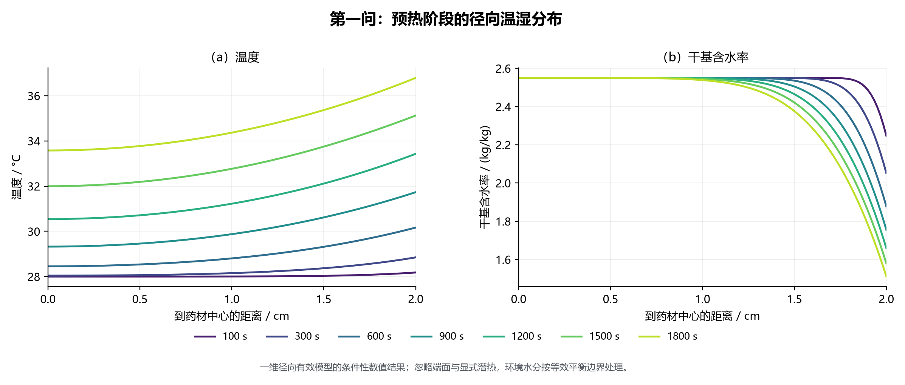
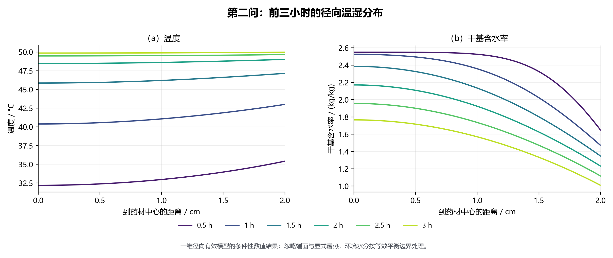

# 5　统一物理模型

## 5.1　几何与定义

### 5.1.1　薄壳几何

用途：轴对称降维；自变量：$r$；因变量：$\mathrm{d}V$；单位：m³、m²；物理含义：面积体积线性增长。

$$
\mathrm{d}V=\pi\left[(r+\mathrm{d}r)^2-r^2\right]L=2\pi rL\,\mathrm{d}r+O(\mathrm{d}r^2),\qquad A(r)=2\pi rL,
\qquad L=0.25\ \mathrm{m},\quad R_0=0.02\ \mathrm{m}
\tag{2}
$$

### 5.1.2　干湿基含水率

用途：定义状态变量；自变量：$m_w$、$m_d$；因变量：$C$、$w$；单位：kg/kg；物理含义：$w$ 仅用于经验式。[3]

$$
C=\frac{m_w}{m_d},\qquad w=\frac{m_w}{m_d+m_w}=\frac{C}{1+C},\qquad C=\frac{w}{1-w}
\tag{3}
$$

判据 $C=0.15$ 即湿基 13.04%，**不是 15%**。

### 5.1.3　初始干密度

用途：$C$ 与水质量密度换算；自变量：$C_0$；因变量：$\rho_{d0}$；单位：kg/m³；物理含义：$\rho_d$ 由守恒定。

$$
\rho_{d0}=\frac{\rho_{\mathrm{eff}}(C_0)}{1+C_0}
\quad\Longrightarrow\quad
\begin{cases}
\text{问题一：} 820/3.55=230.9860\ \mathrm{kg/m^3}\\
\text{问题二、三：} (650+128\times2.55)/3.55=275.0423\ \mathrm{kg/m^3}\\
\text{问题四：} (760+90\times2.55)/3.55=278.7324\ \mathrm{kg/m^3}
\end{cases}
\tag{4}
$$

## 5.2　守恒方程

### 5.2.1　干物质守恒

用途：约束骨架运动；自变量：$t$、$r$；因变量：$\rho_d$、$u$；单位：kg/(m³·s)；物理含义：随骨架输运变化。

$$
\frac{\partial \rho_d}{\partial t}+\frac{1}{r}\frac{\partial}{\partial r}\left(r\rho_d u\right)=0
\tag{5}
$$

### 5.2.2　水分守恒

用途：水的守恒；自变量：$t$、$r$；因变量：$j_w$；单位：kg/(m³·s)；物理含义：输运与迁移之和。

$$
\frac{\partial}{\partial t}\left(\rho_d C\right)+\frac{1}{r}\frac{\partial}{\partial r}\left[\,r\left(\rho_d C u+j_w\right)\right]=0
\tag{6}
$$

### 5.2.3　含水率方程

用途：消去骨架速度；单位：1/s；物理含义：随体变化率=扩散净流入。式 (6) 减 $C$ 倍式 (5)：

$$
\rho_d\left(\frac{\partial C}{\partial t}+u\frac{\partial C}{\partial r}\right)=-\frac{1}{r}\frac{\partial}{\partial r}\left(r j_w\right)
\tag{7}
$$

## 5.3　本构关系

### 5.3.1　傅里叶定律

用途：温度梯度与热流；自变量：$\partial T/\partial r$；因变量：$q_r$；单位：W/m²；物理含义：取**向外为正**。[2]

$$
q_r=-k\frac{\partial T}{\partial r}
\tag{8}
$$

### 5.3.2　菲克本构

用途：含水率梯度与通量；因变量：$j_w$；单位：kg/(m²·s)；物理含义：水由高向低迁移。[4]

$$
j_w=-\rho_d D\frac{\partial C}{\partial r}
\tag{9}
$$

## 5.4　主控方程

### 5.4.1　热方程

用途：内部温度演化；自变量：$t$、$r$；因变量：$T$；单位：K/s；物理含义：热容量×升温率=净流入热流。[2]

$$
B(C)\frac{\partial T}{\partial t}=\frac{1}{r}\frac{\partial}{\partial r}\left(r\,k(C)\frac{\partial T}{\partial r}\right),
\qquad B(C)=\rho_{\mathrm{eff}}(C)\,c_p(C)
\tag{10}
$$

### 5.4.2　水分方程

用途：含水率演化；因变量：$C$；单位：1/s。[13]

$$
\frac{\partial C}{\partial t}=\frac{1}{r}\frac{\partial}{\partial r}\left(r\,D(C,T)\frac{\partial C}{\partial r}\right)
\tag{11}
$$

### 5.4.3　不能移出散度

用途：须保留散度形式；单位：K/s；物理含义：$k$ 变化引入梯度驱动项。

$$
\frac{1}{r}\frac{\partial}{\partial r}\left(rk\frac{\partial T}{\partial r}\right)
=k\frac{\partial^2 T}{\partial r^2}+\frac{k}{r}\frac{\partial T}{\partial r}
+\frac{\mathrm{d}k}{\mathrm{d}C}\frac{\partial C}{\partial r}\frac{\partial T}{\partial r}
\tag{12}
$$

> **两处必须写明的边界**：
> ① 式 (12) 末项 $\dfrac{\mathrm{d}k}{\mathrm{d}C}C_rT_r$ **不能漏**，它体现物性随状态变化；
> ② **不能**把式 (10) 左端的 $B(C)\dfrac{\partial T}{\partial t}$ 改写成 $\dfrac{\partial}{\partial t}\left[B(C)T\right]$：
> $$\frac{\partial}{\partial t}\left(B T\right)=B\frac{\partial T}{\partial t}+T\frac{\mathrm{d}B}{\mathrm{d}C}\frac{\partial C}{\partial t},$$
> 多出的 $T\,\mathrm{d}B/\mathrm{d}C\cdot\partial_tC$ 项**无对应的物理过程**。

## 5.5　材料坐标与移动域

### 5.5.1　坐标变换

用途：收缩域映射为材料域；自变量：$x=r/R(t)$；单位：无量纲；物理含义：$x$ 恒对应同一材料。[6]

$$
x=\frac{r}{R(t)},\qquad F(x,t)=f\!\left(R(t)x,\,t\right)
\tag{13}
$$

$$
\left.\frac{\partial f}{\partial t}\right|_{r}=\left.\frac{\partial F}{\partial t}\right|_{x}-\frac{xR'}{R}\frac{\partial F}{\partial x},
\qquad
\frac{\partial f}{\partial r}=\frac{1}{R}\frac{\partial F}{\partial x}
\tag{14}
$$

### 5.5.2　干骨架守恒

用途：推断内部运动与 $\rho_d$；因变量：$u$、$\rho_d$；单位：m/s、kg/m³；物理含义：与骨架守恒相容。

$$
u(r,t)=\frac{rR'(t)}{R(t)},\qquad
\rho_d(t)=\rho_{d0}\frac{R_0^{2}}{R(t)^{2}}
\tag{15}
$$

### 5.5.3　统一方程

用途：实际求解形式（式 (1)）；单位：K/s、1/s；物理含义：$R^{-2}$ 仅来自几何。

$$
B(C)\frac{\partial T}{\partial t}=\frac{1}{R(t)^{2}x}\frac{\partial}{\partial x}\left(x\,k(C)\frac{\partial T}{\partial x}\right),
\qquad
\frac{\partial C}{\partial t}=\frac{1}{R(t)^{2}x}\frac{\partial}{\partial x}\left(x\,D(C,T)\frac{\partial C}{\partial x}\right)
\tag{16}
$$

> **必须在论文中写明的两个"不能"**：
> ① 因为 $C$ 是"水与干物质的质量比"而不是"每立方米的水质量"，收缩不改变其基准，**不能**额外添加 $-2R'C/R$ 的体积浓缩项；
> ② 因为已采用材料坐标且网格随材料运动，**不能**再重复添加 $xR'C_x/R$ 的网格平流项。

### 5.5.4　扩散尺度

用途：$D_4/D_{23}$ 比值；单位：无量纲；物理含义：附录 4 的 $D$ 更小。

$$
\left.\frac{D_4}{D_{23}}\right|_{T,C}
=\frac{4.2\times10^{-4}}{2.4\times10^{-3}}\exp\!\left(\frac{0.15}{C}\right)
=0.175\exp\!\left(\frac{0.15}{C}\right)\le 0.476\qquad(C\ge0.15)
\tag{17}
$$

## 5.6　初值与边界条件

### 5.6.1　初始条件

用途：唯一解；单位：K、kg/kg；物理含义：初值均匀。

$$
T(x,0)=301.15\ \mathrm{K}\ (28\ ^\circ\mathrm{C}),\qquad C(x,0)=2.55\ \mathrm{kg/kg}
\tag{18}
$$

### 5.6.2　中心对称

用途：处理 $r\to0$ 奇异性；单位：K/m、1/m；物理含义：零通量，非固定温度。

$$
\left.\frac{\partial T}{\partial x}\right|_{x=0}=0,\qquad
\left.\frac{\partial C}{\partial x}\right|_{x=0}=0,
\qquad\text{中心极限为}\ \frac{1}{r}\frac{\partial}{\partial r}\left(r\frac{\partial f}{\partial r}\right)\to 2\frac{\partial^{2}f}{\partial r^{2}}
\tag{19}
$$

### 5.6.3　热边界

用途：表面能量交换；因变量：$T_s$、$C_s$；单位：W/m²；物理含义：热流分为升温与汽化。

$$
k\left.\frac{\partial T}{\partial n}\right|_{s}=h\left(T_\infty-T_s\right)+\varepsilon\sigma\left(T_w^{4}-T_s^{4}\right)-L_v\,j_n
\tag{20}
$$

基线取**无辐射与潜热**边界：

$$
-k\left.\frac{\partial T}{\partial r}\right|_{r=R}=h\left[T_s-T_\infty(t)\right],
\qquad h=25\ \mathrm{W/(m^2\cdot K)}
\tag{21}
$$

材料坐标：

$$
-\frac{k}{R}\left.\frac{\partial T}{\partial x}\right|_{x=1}=h\left(T_s-T_\infty(t)\right)
\tag{22}
$$

### 5.6.4　水分边界

用途：表面水分交换；单位：kg/(m²·s)；物理含义：由 $C_s-C_{eq}$ 与 $\beta$ 驱动。[5][7]

$$
-D\left.\frac{\partial C}{\partial r}\right|_{r=R}=\beta\left[C_s-C_{eq}(t)\right],
\qquad \beta=8\times10^{-7}\ \mathrm{m/s}
\tag{23}
$$

材料坐标：

$$
-\frac{D}{R}\left.\frac{\partial C}{\partial x}\right|_{x=1}=\beta\left[C_s-C_{eq}(t)\right]
\tag{24}
$$

> $C_{eq}$ 取烘房给出的水分浓度（假设 A04）；严格气固平衡需
> $$p_{v,\infty}=\frac{p\,Y}{0.621945+Y},\qquad p_{v,s}=a_w(C_s,T_s)\,p_{\mathrm{sat}}(T_s),\qquad \text{零净蒸发要求}\ p_{v,\infty}=p_{v,s}$$
> **缺少吸附等温线时 $C_{eq}$ 无法唯一恢复**。

### 5.6.5　等效通量

用途：式 (23) 为等效通量；单位：kg/(m²·s)；物理含义：乘 $\rho_d$ 后为真实失水率。

$$
j_w\big|_{s}=\rho_d\,\beta\left(C_s-C_{eq}\right)
\tag{25}
$$

## 5.7　题给经验关系

> **定性说明（必须写进论文）**：以下 9 条经验式均为**题目给定**，本文按原始形式采用，**未作重新拟合**；题目未提供样本，故**不报告、也不能报告拟合优度或系数置信区间**。

### 5.7.1　问题一

用途：常物性与 $D(C)$；自变量：$C$；因变量：$\rho$、$c_p$、$k$、$D$；单位：kg/m³、J/(kg·K)、W/(m·K)、m²/s。[1]

$$
\rho=820\ \mathrm{kg/m^3},\qquad c_p=2600\ \mathrm{J/(kg\cdot K)},\qquad k=0.36\ \mathrm{W/(m\cdot K)}
\tag{26}
$$

$$
D_1(C)=7\times10^{-9}\exp\!\left(-\frac{0.89}{C}\right)\ \mathrm{m^2/s}
\tag{27}
$$

### 5.7.2　问题二、三

用途：随 $C$ 变化的物性与 $D(C,T)$；自变量：$C$、$C,T$；单位：同式 (26)；物理含义：$\rho$、$k$ 近似线性，$D$ 为 Arrhenius 型。

$$
\rho_{23}(C)=650+128C
\tag{28}
$$

$$
c_{p,23}(C)=1450+2736\,\frac{C}{C+1}
\tag{29}
$$

$$
k_{23}(C)=0.21+0.38\,\frac{C}{C+1}
\tag{30}
$$

$$
D_{23}(C,T)=2.4\times10^{-3}\exp\!\left(-\frac{0.45}{C}\right)\exp\!\left(-\frac{3850}{T}\right)\ \mathrm{m^2/s}
\tag{31}
$$

### 5.7.3　问题四

$$
\rho_{4}(C)=760+90C
\tag{32}
$$

$$
c_{p,4}(C)=1850+2150\,\frac{C}{C+1}
\tag{33}
$$

$$
k_{4}(C)=0.12+0.20\,\frac{C}{C+1}
\tag{34}
$$

$$
D_{4}(C,T)=4.2\times10^{-4}\exp\!\left(-\frac{0.30}{C}\right)\exp\!\left(-\frac{3850}{T}\right)\ \mathrm{m^2/s}
\tag{35}
$$

### 5.7.4　结构解释

同温按质量加权：[3]

$$
c_p=\frac{m_d c_d+m_w c_w}{m_d+m_w}=c_d+\left(c_w-c_d\right)\frac{C}{1+C}
\tag{36}
$$

对式 (31) 求导：

$$
\ln\frac{D_{23}}{D_0}=-\frac{0.45}{C}-\frac{3850}{T},
\qquad
\frac{\partial}{\partial T}\ln\frac{D_{23}}{D_0}=\frac{3850}{T^{2}}>0,
\qquad
\frac{\partial}{\partial C}\ln\frac{D_{23}}{D_0}=\frac{0.45}{C^{2}}>0
\tag{37}
$$

## 5.8　无量纲数

用途：判断梯度与传热传质快慢；单位：无量纲。[12]

$$
Bi_h=\frac{hR_0}{k},\qquad
Bi_m=\frac{\beta R_0}{D},\qquad
\alpha=\frac{k}{\rho_{\mathrm{eff}}c_p},\qquad
Fo_T=\frac{\alpha t}{R_0^{2}},\qquad
Fo_C=\frac{Dt}{R_0^{2}}
\tag{38}
$$

表 12 的完整内容见附录 C。

**表 11　题给经验关系汇总**

| 编号 | 用途 | 自变量 → 因变量 | 适用问题 | 表达式 | 单位 |
|---|---|---|---|---|---|
| E01 | 水分扩散系数 | $C\to D$ | 一 | $D=7\times10^{-9}e^{-0.89/C}$ | m²/s |
| E02 | 密度 | $C\to\rho$ | 二、三 | $\rho=650+128C$ | kg/m³ |
| E03 | 比热容 | $C\to c_p$ | 二、三 | $c_p=1450+2736C/(C+1)$ | J/(kg·K) |
| E04 | 导热系数 | $C\to k$ | 二、三 | $k=0.21+0.38C/(C+1)$ | W/(m·K) |
| E05 | 水分扩散系数 | $(C,T)\to D$ | 二、三 | $D=2.4\times10^{-3}e^{-0.45/C}e^{-3850/T}$ | m²/s |
| E06 | 密度 | $C\to\rho$ | 四 | $\rho=760+90C$ | kg/m³ |
| E07 | 比热容 | $C\to c_p$ | 四 | $c_p=1850+2150C/(C+1)$ | J/(kg·K) |
| E08 | 导热系数 | $C\to k$ | 四 | $k=0.12+0.20C/(C+1)$ | W/(m·K) |
| E09 | 水分扩散系数 | $(C,T)\to D$ | 四 | $D=4.2\times10^{-4}e^{-0.30/C}e^{-3850/T}$ | m²/s |

---

# 6　问题一：预热平衡阶段

## 6.1　模型建立

附录 2 常物性（$\rho=820$、$c_p=2600$、$k=0.36$），$D$ 仅依赖 $C$（式 (27)）：

$$
B_1\frac{\partial T}{\partial t}=\frac{1}{r}\frac{\partial}{\partial r}\left(r\,k_1\frac{\partial T}{\partial r}\right),
\qquad B_1=\rho_1 c_{p,1}=2.132\times10^{6}\ \mathrm{J/(m^3\cdot K)}
\tag{39}
$$

$$
\frac{\partial C}{\partial t}=\frac{1}{r}\frac{\partial}{\partial r}\left[r\,D_1(C)\frac{\partial C}{\partial r}\right]
\tag{40}
$$

初边值条件：式 (18)、(19)、(21)、(23)。

## 6.2　求解方法

参数：$N=3200$（节点 3201，网格 $6.25\ \mu\mathrm{m}$），$rtol=10^{-10}$，$atol_T=10^{-10}$ K，$atol_C=10^{-12}$ kg/kg，前 4 h 步长 2 s、之后 120 s；式 (39) 独立可解、式 (40) 与温度不耦合。

## 6.3　结果

**表 9（题面表 1）　30 分钟内药材的温度（单位：°C）**

| 时间/s | 0 | 0.5 | 1 | 1.5 | 2 |
|---|---|---|---|---|---|
| 100 | 28.0001 | 28.0003 | 28.0040 | 28.0327 | 28.1801 |
| 300 | 28.0408 | 28.0635 | 28.1514 | 28.3681 | 28.8489 |
| 600 | 28.4533 | 28.5360 | 28.8039 | 29.3159 | 30.1652 |
| 900 | 29.3243 | 29.4583 | 29.8755 | 30.6161 | 31.7304 |
| 1200 | 30.5427 | 30.7098 | 31.2223 | 32.1126 | 33.4276 |
| 1500 | 31.9957 | 32.1867 | 32.7660 | 33.7463 | 35.1203 |
| 1800 | 33.5753 | 33.7720 | 34.3642 | 35.3621 | 36.7856 |

**表 10（题面表 2）　30 分钟内药材的水分浓度（单位：kg/kg，干基）**

| 时间/s | 0 | 0.5 | 1 | 1.5 | 2 |
|---|---|---|---|---|---|
| 100 | 2.5500 | 2.5500 | 2.5500 | 2.5500 | 2.2470 |
| 300 | 2.5500 | 2.5500 | 2.5500 | 2.5492 | 2.0508 |
| 600 | 2.5500 | 2.5500 | 2.5500 | 2.5353 | 1.8770 |
| 900 | 2.5500 | 2.5500 | 2.5497 | 2.5045 | 1.7547 |
| 1200 | 2.5500 | 2.5500 | 2.5482 | 2.4646 | 1.6586 |
| 1500 | 2.5500 | 2.5499 | 2.5445 | 2.4206 | 1.5787 |
| 1800 | 2.5500 | 2.5497 | 2.5383 | 2.3755 | 1.5102 |

{width=12.5cm}

## 6.4　结果分析

（1）1800 s 未达热平衡：表面 28.0000→**36.7856 °C**、中心 **33.5753 °C**，温差 **3.2103 °C**，$Bi_h=1.3889$ 须用分布参数模型。

（2）水分变化仅限表层：中心与 1 cm 内基本不变（2.5500、2.5383），表面 2.5500→**1.5102**（**−40.8%**）。

（3）热量渗透远快于水分：$Fo_T=0.75985$、$Fo_C=0.022219$，相差约 **34 倍**（$\alpha/D=34.20$）。

（4）热场可验证：240 项 Bessel 解最大偏差 **1.803776172×10⁻⁶ K**，480 项 **1.790786825×10⁻⁶ K**。

---

# 7　问题二：热湿耦合全过程

## 7.1　模型建立

经验式**采用附录 3**，$t=0$ 起全程用式 (28)—(31)：

$$
B(C)\frac{\partial T}{\partial t}=\frac{1}{r}\frac{\partial}{\partial r}\left(r\,k_{23}(C)\frac{\partial T}{\partial r}\right),
\qquad B(C)=\rho_{23}(C)\,c_{p,23}(C)
\tag{41}
$$

$$
\frac{\partial C}{\partial t}=\frac{1}{r}\frac{\partial}{\partial r}\left[r\,D_{23}(C,T)\frac{\partial C}{\partial r}\right]
\tag{42}
$$

初边值条件同 6.1；0—4 h 环境由附件 1 插值，$t>14400$ s 取 $T_\infty=323.15$ K、$C_{eq}=0.05$。

> **三处必须写明的口径**：
> ① **本问从 $t=0$ 重新开始**，全程采用附录 3，**不是**在 1800 s 之后才切换物性，**更不能以问题一末状态为本问初值**；
> ② 式 (41) 中的 $B(C)$ 位于**时间导数外侧**，$k_{23}(C)$ 与 $D_{23}(C,T)$ 必须留在**空间导数内部**，二者不能按常数提出；
> ③ 温度 $T$ 进入式 (31) 的 Arrhenius 项前必须换算为**开尔文**。

## 7.2　双向耦合

式 (41)、式 (42) 双向耦合，须**联立求解**。

## 7.3　求解设置

参数同 6.2；$t=14400$ s 处**断开分段**。

## 7.4　结果

**表 15（题面表 3）　3 小时内药材的温度（单位：°C）**

| 时间/h | 0 | 0.5 | 1 | 1.5 | 2 |
|---|---|---|---|---|---|
| 0.5 | 32.1892 | 32.3821 | 32.9659 | 33.9608 | 35.4130 |
| 1.0 | 40.3816 | 40.5536 | 41.0605 | 41.8782 | 42.9976 |
| 1.5 | 45.8468 | 45.9348 | 46.1930 | 46.6051 | 47.1401 |
| 2.0 | 48.4502 | 48.4881 | 48.5984 | 48.7736 | 49.0033 |
| 2.5 | 49.4670 | 49.4792 | 49.5136 | 49.5653 | 49.6609 |
| 3.0 | 49.8495 | 49.8553 | 49.8746 | 49.9101 | 49.9664 |

**表 16（题面表 4）　3 小时内药材的水分浓度（单位：kg/kg，干基）**

| 时间/h | 0 | 0.5 | 1 | 1.5 | 2 |
|---|---|---|---|---|---|
| 0.5 | 2.5499 | 2.5489 | 2.5256 | 2.3257 | 1.6486 |
| 1.0 | 2.5257 | 2.4948 | 2.3578 | 2.0230 | 1.4711 |
| 1.5 | 2.3861 | 2.3256 | 2.1344 | 1.8020 | 1.3476 |
| 2.0 | 2.1709 | 2.1084 | 1.9236 | 1.6259 | 1.2311 |
| 2.5 | 1.9566 | 1.9006 | 1.7360 | 1.4720 | 1.1166 |
| 3.0 | 1.7662 | 1.7165 | 1.5702 | 1.3333 | 1.0081 |

{width=12.5cm}

## 7.5　结果分析

（1）温度约 2 h 内均衡：3 h 表面 **49.9664 °C**（环境约 50 °C）、中心 49.8495 °C，差 **0.1169 °C**，0.5 h 表面 35.4130 °C。

（2）水分梯度远大于温度梯度：3 h 表面 **1.0081**、中心 **1.7662**，差 **0.7581** kg/kg（中心值的 42.9%）。

（3）已进入恒温干燥阶段：$\alpha/D\approx25.7$（快约 26 倍），题述两阶段无需分段。

（4）解覆盖 $t=0$—**206902** s（约 57.47 h），逐秒、每 0.1 cm 输出；3 h 仅为展示窗口。

---
