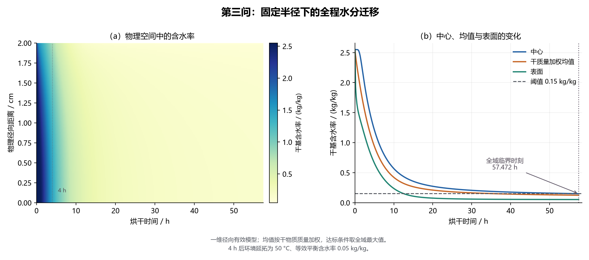
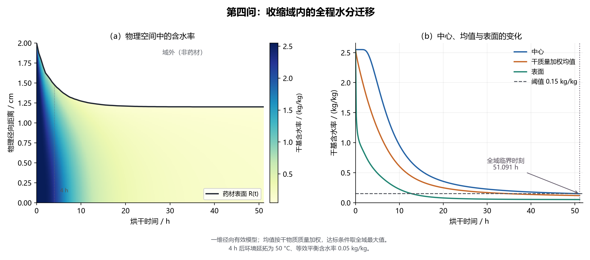
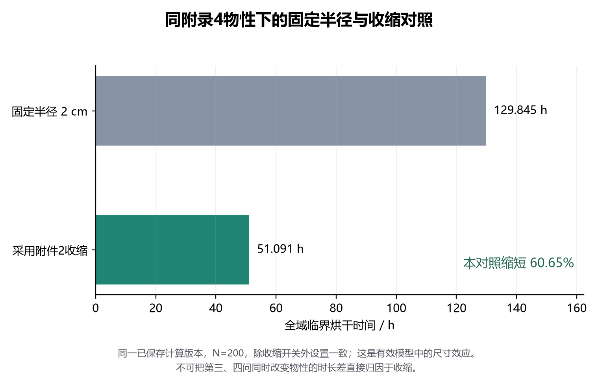
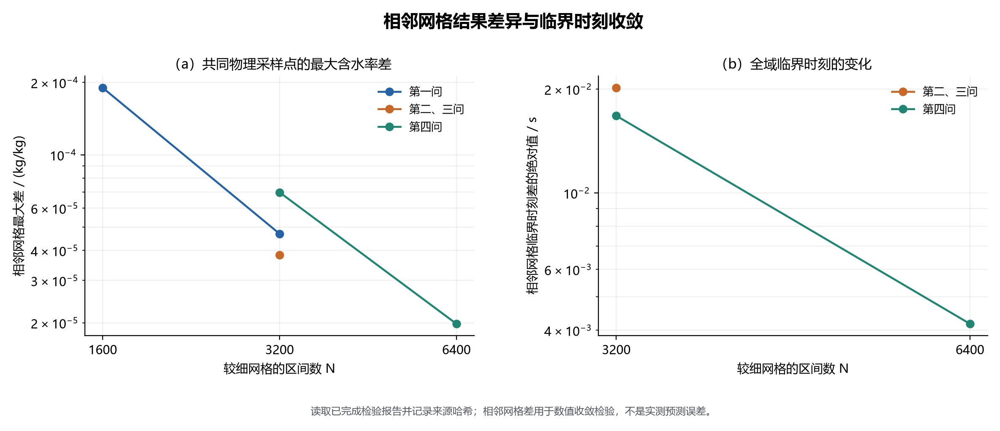
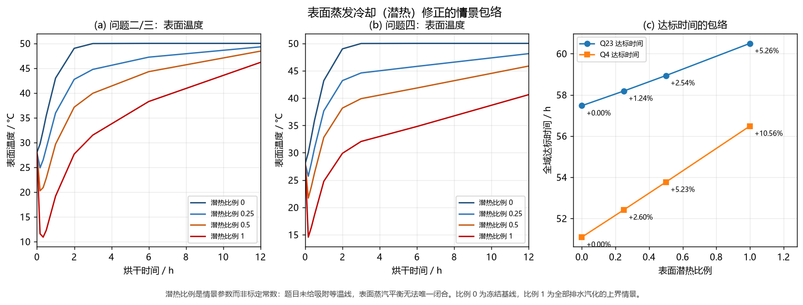

# 8　问题三：全域达标时间的确定

## 8.1　达标判据

问题三只在问题二的解上施加判据。题面要求"药材**各处**低于 0.15 kg/kg"，故被控量取**空间最大值**：

$$
M(t)=\max_{0\le x\le1}C(x,t),\qquad
t_*=\inf\left\{\,t\ge0:\ M(t)<0.15\,\right\}
\tag{43}
$$

**用途**：定义烘干时间；**自变量**：$t$；**因变量**：$M$、$t_*$；**单位**：kg/kg、s；**物理含义**：**每一处**达标，而非平均值达标。

三点须写明：① 判据为**全域最大值**，用平均值会显著低估时长（第 7.5 节：3 h 时中心为表面的 1.75 倍）；② 最大值位置**不能事先假定**，程序对全部 $N+1$ 个节点逐一检查；③ 显示值 `0.1500` **不能**证明严格小于 0.15，判定须用**未舍入**值。

## 8.2　严格性处理

数值求根给出**连续穿越时刻**，与四位小数报告口径的关系为

$$
\hat n=\left\lceil \frac{10^{4}\,\hat t_{*}}{3600}\right\rceil,
\qquad
t_{\mathrm{rep,s}}=0.36\,\hat n,
\qquad
t_{\mathrm{rep,h}}=\frac{\hat n}{10^{4}}
\tag{44}
$$

**用途**：连续临界时刻→严格可行的报告时刻；**单位**：$\hat n$ 无量纲，$t_{\mathrm{rep,s}}$、$t_{\mathrm{rep,h}}$ 为 s、h；**物理含义**：网格**向上取整**后用未舍入场值复核 $M(t_{\mathrm{rep}})<0.15$。
结果：连续临界时刻 $t_*=57.47230195056044$ h，报告时间 $t_{\mathrm{rep}}=$ **57.4724 h**，报告时刻未舍入全域最大含水率 $0.14999989718225315<0.15$ ✓，折合 2.3947 天（约 **2.39 天**），最慢位置为圆心（材料坐标 $x=0$）。

> **报告口径**：57.4724 h 是 0.0001 h 网格**向上取整**得到的严格可行时刻，**不等于**"精确到 0.36 秒"；连续穿越时刻为 57.4723 h（四位），差异仅来自取整方向。

## 8.3　结果

**表 20（题面表 5）　药材烘干过程的水分浓度（单位：kg/kg，干基）**

| 时间/h | 0 | 0.5 | 1 | 1.5 | 2 |
|---|---|---|---|---|---|
| 6 | 1.0170 | 0.9881 | 0.9015 | 0.7550 | 0.5328 |
| 12 | 0.4561 | 0.4432 | 0.4031 | 0.3297 | 0.1642 |
| 18 | 0.2988 | 0.2915 | 0.2687 | 0.2253 | 0.0845 |
| 24 | 0.2378 | 0.2327 | 0.2167 | 0.1855 | 0.0665 |
| 30 | 0.2058 | 0.2018 | 0.1892 | 0.1641 | 0.0598 |
| 36 | 0.1859 | 0.1825 | 0.1718 | 0.1504 | 0.0566 |
| 42 | 0.1721 | 0.1691 | 0.1597 | 0.1407 | 0.0549 |
| 48 | 0.1618 | 0.1592 | 0.1507 | 0.1334 | 0.0537 |
| 54 | 0.1539 | 0.1514 | 0.1436 | 0.1277 | 0.0530 |
| **57.4724（烘干结束）** | **0.1500** | 0.1477 | 0.1402 | 0.1249 | 0.0527 |

末行中心列显示 `0.1500` 而**未舍入值小于 0.15**，**不得手改为 0.1499**。

{width=12.5cm}

## 8.4　最慢位置与严格性证据

（1）**最慢位置为圆心。** 57.4724 h 时中心 0.1500（未舍入 0.1499999）、0.5 cm 处 0.1477、表面 0.0527；只看表面会在约 30 h 误判达标。

（2）**独立复核。** 另用**独立二分求根**求 $M(t)-0.15$：事件根 57.47232976164861 h 与二分根 57.472329761648595 h 相差 $5.82\times10^{-11}$ s；严格复核时刻未舍入最大含水率 0.14999953019871928<0.15 ⇒ 报告时刻**不依赖事件求解器实现**。

（3）**网格敏感性。** $N=800$ 事件 57.472329762 h 对正式网格 $N=3200$ 的 57.47230195056044 h，差约 $1.0\times10^{-4}$ h（约 0.36 s），粗网格**不能作为正式时长**。

（4）**最慢位置的严谨表述。** 在采样时刻直接取 $\arg\max$ 时，最大值可能落在多个不同节点上（问题四出现 21 个不同 $x$）。经核查，其原因是此时剖面已平坦到**浮点舍入量级**：圆心相对全域最大值的超出量，问题三最大为 $8.882\times10^{-16}$ kg/kg、中位为 0。故本文的表述是“最大值位于圆心，圆心与全域最大值的差不超过约 $10^{-15}$ kg/kg”，而**不**写成“逐时 $\arg\max$ 恒为圆心”。
## 8.5　结论

以空间最大含水率严格低于 0.15 kg/kg 为判据，固定半径下烘干时间为 **57.4724 h（约 2.39 天）**，落在题目 2—3 天周期内，由药材中心控制。干燥速率迅速衰减：0→6 h 表面含水率由 2.5500 降到 0.5328，48→57.4724 h 中心仅由 0.1618 降到 0.1500（传质驱动力减小，且式 (37) $D\propto e^{-0.45/C}$ 随含水率降低迅速减小）。

# 9　问题四：收缩条件下的烘干时长

## 9.1　模型建立

问题四整组用附录 4 物性（式 (32)—(35)）并叠加附件 2 的半径收缩，控制方程取式 (16) 的材料坐标形式：

$$
B_4(C)\frac{\partial T}{\partial t}=\frac{1}{R(t)^{2}x}\frac{\partial}{\partial x}\left(x\,k_4(C)\frac{\partial T}{\partial x}\right),
\qquad
\frac{\partial C}{\partial t}=\frac{1}{R(t)^{2}x}\frac{\partial}{\partial x}\left(x\,D_4(C,T)\frac{\partial C}{\partial x}\right)
\tag{45}
$$

$$
B_4(C)=\rho_4(C)\,c_{p,4}(C),
\qquad
\rho_d(t)=\rho_{d0}\left(\frac{R_0}{R(t)}\right)^{2},
\qquad
\rho_{d0}=278.7324\ \mathrm{kg/m^3}
\tag{46}
$$

边界条件取式 (22)、式 (24) 的材料坐标形式，判据同式 (43)。半径 $R(t)$ 由附件 2 的 145 个观测点**分段线性插值**得到，程序**只用 $R$ 值、不对折线求数值导数**；半径由 2.000 cm 单调减至约 1.198 cm。
## 9.2　数据依据与净效应识别

问题四相对问题三同时改变了**物性**（附录 3→附录 4）与**几何**（固定半径→收缩），故两问时长差（$57.4724-51.0906=6.3818$ h）**不能全部归因于收缩**；收缩净效应只能由 9.5 节的同物性对照单独给出。

## 9.3　结果

**表 22（题面表 6）　药材烘干过程的水分浓度（单位：kg/kg，干基）**

| 时间/h | 0 | 0.5 | 1 | 1.5 | 2 | **药材表面** |
|---|---|---|---|---|---|---|
| 6 | 1.7196 | 1.5377 | 1.0226 | —（域外） | —（域外） | 0.4207 |
| 12 | 0.7377 | 0.6546 | 0.4083 | —（域外） | —（域外） | 0.1670 |
| 18 | 0.4087 | 0.3686 | 0.2397 | —（域外） | —（域外） | 0.0892 |
| 24 | 0.2851 | 0.2611 | 0.1790 | —（域外） | —（域外） | 0.0673 |
| 30 | 0.2263 | 0.2094 | 0.1493 | —（域外） | —（域外） | 0.0595 |
| 36 | 0.1928 | 0.1797 | 0.1317 | —（域外） | —（域外） | 0.0560 |
| 42 | 0.1712 | 0.1604 | 0.1200 | —（域外） | —（域外） | 0.0541 |
| 48 | 0.1561 | 0.1468 | 0.1116 | —（域外） | —（域外） | 0.0530 |
| **51.0906（烘干结束）** | **0.1500** | 0.1413 | 0.1081 | —（域外） | —（域外） | 0.0526 |

半径 6 h 已缩至 1.3740 cm 并继续收缩，故 **1.5 cm 与 2.0 cm 两列自始至终位于药材之外**：实际输出应填"—（域外）"，**绝不能填 0**——0 表示"完全干燥"，与"不在药材内"含义相反。末行中心列显示 `0.1500`，未舍入值严格小于 0.15。

**表 23　问题四各报告时刻的药材表面半径（单位：cm）**

| 时间/h | 6 | 12 | 18 | 24 | 30 | 36 | 42 | 48 | 51.0906 |
|---|---|---|---|---|---|---|---|---|---|
| 表面半径/cm | 1.3740 | 1.2480 | 1.2140 | 1.2040 | 1.2010 | 1.2000 | 1.2000 | 1.2000 | 1.2000 |

结果：连续临界时刻 $t_*=51.09057478683054$ h，报告时间 $t_{\mathrm{rep}}=$ **51.0906 h**，报告时刻未舍入全域最大含水率 $0.14999995339076624<0.15$ ✓，折合 2.1288 天（约 **2.13 天**），结束时半径 1.2000 cm，最慢位置为圆心，且**未使用半径外推**（51.09 h < 72 h）。

{width=12.5cm}

## 9.4　结果分析

（1）**收缩对网格更敏感。** $N=800$ 事件 51.090599156 h 对正式网格 $N=6400$ 的 51.09057478683054 h，差约 $2.44\times10^{-5}$ h（约 0.088 s），故 $N=800$ **绝不能当作正式时长**。

（2）**中心控制达标不变：** 51.0906 h 时中心 0.1500、1 cm 处 0.1081、表面 0.0526。

（3）**归因限制。** 前中期问题四中心含水率反而更高（24 h：0.2851 对 0.2378），约 40 h 后反转；因两问同时改变了物性与几何，该交叉只能作为观测事实报告，**不能单独归因于任一因素**，单独归因须依据 9.5 节同物性对照。

## 9.5　收缩的净效应

用**同附录 4 物性、固定半径与收缩半径**的对照（同参数、同源码版本）分离收缩作用：

**表 26　同附录 4 物性下的收缩净效应对照**

| 对照条件（附录 4 物性） | 全域达标时间 | 折合 |
|---|---:|---|
| 固定半径 $R_0=2$ cm | 129.8452 h | 约 5.41 天 |
| 实际收缩 $R(t)$（附件 2） | 51.0910 h | 约 2.13 天 |
| **收缩带来的缩短** | **缩短 60.65%** | — |
| 按 $(R_0/R)^2$ 折算的等效定半径时间 | 131.6198 h | 与直接模拟相差 **1.37%** |

同物性下收缩使烘干时间由约 129.85 h 缩短到约 51.09 h，缩短约 **60.7%**；机理是扩散时间尺度 $\tau\sim R^{2}/D$ 随半径减小而缩短（$R$ 由 2 cm 降至约 1.2 cm，$R^{2}$ 降至约 36%）。

**两条限制**：1. 固定半径对照的 129.85 h **超出题目"2—3 天"范围，也超出附件 2 的 72 h 观测范围**，只能作机理对照、**不能作为答案**；2. 附件只给半径轨迹、**无内部位移观测**，同比径向收缩是"与表面速度和均匀干骨架守恒相容的最简闭合"，属假设 A06。

{width=9.5cm}

## 9.6　结论

计入附件 2 半径收缩后烘干时间为 **51.0906 h（约 2.13 天）**，落在题目 2—3 天区间内；报告时刻半径收缩至 1.2000 cm，且**未使用 72 h 之后的半径外推**。与问题三的 6.38 h 差值因两问物性与几何同时不同，不能全部解释为收缩；同物性对照显示收缩本身贡献约 60.7%。

---

# 10　数值求解方法与模型检验

## 10.1　求解策略概述

式 (10)、式 (11)、式 (16) 为带非线性系数与 Robin 边界的刚性抛物型方程组。求解链：**有限体积离散 → Kirchhoff 浓度势湿通量 → 刚性 ODE → 隐式 BDF/NDF → 事件复核 → 稠密输出**。

### 10.1.1　方程组的四个数学特征与方法选择的理由

① 热扩散 0.6580—1.4154 h 与水分扩散 19.6947—106.1119 h 差 25—75 倍，显式步长限在 $10^{3}$—$10^{4}$ s 而过程 $2\times10^{5}$ s，**故用隐式**。② $D\propto e^{-a/C}$ 跨约 3.6 个数量级（$3.12\times10^{-12}$—$1.25\times10^{-8}$ m²/s），**故湿通量按浓度势精确积分**。③ 驱动由附件 1 线性插值给出，**故网格含表面节点并在 $t=14400$ s 断开**。④ 问题四半径 2→约 1.2 cm，**故以式 (13)—(16) 化为固定域**。

## 10.2　空间离散：守恒型节点对偶有限体积

### 10.2.1　网格与对偶控制体

式 (47) 网格与控制体加权体积（$\sum_iw_i=1/2$）：

$$
x_i=\frac{i}{N}\ (i=0,1,\dots,N),\qquad
x_{i+1/2}=\frac{x_i+x_{i+1}}{2},
\qquad
w_i=\int_{a_i}^{b_i}x\,\mathrm{d}x=\frac{b_i^{2}-a_i^{2}}{2},
\qquad
\sum_{i=0}^{N}w_i=\frac{1}{2}
\tag{47}
$$

其中 $a_i=x_{i-1/2}$、$b_i=x_{i+1/2}$，$V_i=2\pi L R^{2}w_i$；网格含真实表面节点，Robin 条件直接给出最外侧通量。

### 10.2.2　守恒性的证明（为什么"内部通量严格相消"）

把式 (52) 第二式乘 $2w_i$ 并对全部节点求和：

$$
\sum_{i=0}^{N}2w_i\dot C_i=\sum_{i=0}^{N}\frac{2}{R^{2}}\left(G^{C}_{i+1/2}-G^{C}_{i-1/2}\right)
\tag{47a}
$$

右端为望远镜求和：内部面通量 $G^{C}_{i+1/2}$ 在第 $i$ 式取正号、第 $i+1$ 式取负号，故**内部面项两两相消**，只剩表面上界项与中心下界项：

$$
\sum_{i=0}^{N}2w_i\dot C_i=\frac{2}{R^{2}}\left(G^{C}_{N+1/2}-G^{C}_{1/2}\right)
\tag{47b}
$$

由式 (51) $G^{C}_{1/2}=0$、$G^{C}_{N+1/2}=-\beta R\left(C_N-C_{eq}\right)$，代入并用式 (53) 的 $\dot\ell$ 定义即得

$$
\frac{\mathrm{d}}{\mathrm{d}t}\left[\bar C(t)+\ell(t)\right]=0
\quad\Longrightarrow\quad
\bar C(t)+\ell(t)=\bar C(0)=2.55
\tag{47c}
$$

式 (47c) 即式 (54)：用"同一套面通量同时贡献给左右两侧"的写法守恒自动成立，是**发现实现错误的强诊断量**（检验二）。

## 10.3　内部面热通量：调和平均及其适用性判据

式 (48) 调和平均面热导（W/m），把两段半间距视为串联热阻：

$$
G^{T}_{i+1/2}=\frac{x_{i+1/2}}{\Delta x}\,k_H\left(T_{i+1}-T_i\right),
\qquad
k_H=\frac{2k_i k_{i+1}}{k_i+k_{i+1}},
\qquad
\Delta x=\frac{1}{N}
\tag{48}
$$

它**不等于**对 $k(C)$ 的精确积分（检验三）。

## 10.4　内部面湿通量：Kirchhoff 浓度势（本文的主要数值方法修正）

式 (31)、式 (35) 给出 $D=D_0e^{-b/T}e^{-a/C}$，$(D_0,a,b)$ 取 $(2.4\times10^{-3},0.45,3850)$ 或 $(4.2\times10^{-4},0.30,3850)$；式 (49) 的浓度势 $\Phi(C)$（$\mathrm{Ei}$ 为指数积分函数）：[10]

$$
\Phi(C)=C\,e^{-a/C}+a\,\mathrm{Ei}\!\left(-\frac{a}{C}\right),
\qquad
\Phi'(C)=e^{-a/C}
\tag{49}
$$

式 (50) 面湿通量（m²·(kg/kg)/s）：**只对 $\Phi(C)$ 作差**，温度因子取面温度定值：

$$
G^{C}_{i+1/2}=\frac{x_{i+1/2}}{\Delta x}\,D_0\,e^{-b/\bar T}\left[\Phi(C_{i+1})-\Phi(C_i)\right],
\qquad
\bar T=\frac{T_i+T_{i+1}}{2}
\tag{50}
$$

> 对 $e^{-b/T}\Phi(C)$ 整体作差会引入题目未定义的**温度梯度驱动**交叉扩散项（Soret 型），属伪物理。

**直接对式 (49) 求导可得**

$$
\Phi'(C)=e^{-a/C}+\frac{a}{C}e^{-a/C}-\frac{a}{C}e^{-a/C}=e^{-a/C}
\tag{50a}
$$

## 10.5　表面与中心面通量

式 (51) 表面 Robin 通量与中心对称条件（符号同式 (21)、式 (23)，**向内为正**）：

$$
G^{C}_{N+1/2}=-\beta R\left(C_N-C_{eq}\right),
\qquad
G^{T}_{N+1/2}=-hR\left(T_N-T_\infty\right),
\qquad
G^{T}_{1/2}=G^{C}_{1/2}=0
\tag{51}
$$

## 10.6　半离散常微分方程组

式 (52) 控制体半离散方程（K/s、1/s）：热容量 × 升温速率 = 净导入导热通量

$$
\dot T_i=\frac{G^{T}_{i+1/2}-G^{T}_{i-1/2}}{R^{2}w_iB_i},
\qquad
\dot C_i=\frac{G^{C}_{i+1/2}-G^{C}_{i-1/2}}{R^{2}w_i}
\tag{52}
$$

内部面通量以**相反符号**贡献给左右两侧（见式 (47a)—(47c)）。

## 10.7　累计失水作为附加状态变量

式 (53) 累计失水 $\ell(t)$（kg/kg）与干物质加权场平均 $\bar C(t)$：

$$
\dot\ell=\frac{2\beta}{R}\left(C_N-C_{eq}\right),
\qquad
\bar C(t)=2\sum_{i=0}^{N}w_iC_i(t)
\tag{53}
$$

由式 (52)、式 (53) 即得离散质量恒等式：

$$
\bar C(t)+\ell(t)=\bar C(0)=2.55
\tag{54}
$$

## 10.8　时间推进与解析 Jacobian

### 10.8.1　时间推进方法与解析 Jacobian

**BDF/NDF**（SciPy `solve_ivp`，隐式、变阶 1—5、变步长）配手写**解析稀疏 Jacobian**（式 (52) 每点导数只依赖相邻两点，故为三对角块状稀疏矩阵）。[8][9]

### 10.8.2　解析 Jacobian 的组成

式 (55) 容量系数对含水率的导数（问题二、三）：

$$
\rho_C=128,\qquad
c_{p,C}=\frac{2736}{(1+C)^{2}},\qquad
k_C=\frac{0.38}{(1+C)^{2}},
\qquad
B_C=\rho_C\,c_p+\rho\,c_{p,C}
\tag{55}
$$

式 (56) 扩散系数对状态的导数：

$$
D_C=D\,\frac{a}{C^{2}},
\qquad
D_T=D\,\frac{b}{T^{2}}
\tag{56}
$$

式 (57) 调和平均面对的导数：

$$
\frac{\partial k_H}{\partial k_i}=\frac{2k_{i+1}^{2}}{\left(k_i+k_{i+1}\right)^{2}},
\qquad
\frac{\partial k_H}{\partial k_{i+1}}=\frac{2k_i^{2}}{\left(k_i+k_{i+1}\right)^{2}}
\tag{57}
$$

式 (58) 面通量对相邻含水率的导数：

$$
\frac{\partial G^{C}_{i+1/2}}{\partial C_{i+1}}=\frac{x_{i+1/2}}{\Delta x}D_0e^{-b/\bar T}\Phi'(C_{i+1}),
\qquad
\frac{\partial G^{C}_{i+1/2}}{\partial C_{i}}=\frac{x_{i+1/2}}{\Delta x}D_0e^{-b/\bar T}\Phi'(C_i)
\tag{58}
$$

**最易遗漏项在温度行 × 含水率列**（来自分母 $B_i$）：

$$
\left.\frac{\partial \dot T_i}{\partial C_i}\right|_{\text{热容量项}}
=-\dot T_i\,\frac{B_{C,i}}{B_i}
\tag{59}
$$

### 10.8.3　生产参数设置

**表 21　生产数值设置**

| 参数 | 问题一 | 问题二、三 | 问题四 |
|---|---|---|---|
| 空间区间数 $N$ | 3200 | 3200 | 6400 |
| 节点数 | 3201 | 3201 | 6401 |
| ODE 状态长度（含 $\ell$） | 6403 | 6403 | 12803 |
| 初始物理网格间距 | $6.25\ \mu$m | $6.25\ \mu$m | $3.125\ \mu$m |
| 相对容差 $rtol$ | $10^{-10}$ | $10^{-10}$ | $10^{-10}$ |
| 温度绝对容差 | $10^{-10}$ K | $10^{-10}$ K | $10^{-10}$ K |
| 含水率绝对容差 | $10^{-12}$ kg/kg | $10^{-12}$ kg/kg | $10^{-12}$ kg/kg |
| 最大步长（前 4 h / 之后） | 2 s / 120 s | 2 s / 120 s | 2 s / 120 s |
| 时间方法 | BDF/NDF | BDF/NDF | BDF/NDF |
| 湿面格式 | Kirchhoff 势 | Kirchhoff 势 | Kirchhoff 势 |
| Jacobian | 解析稀疏 | 解析稀疏 | 解析稀疏 |
| 稠密输出存储 | 磁盘 | 磁盘 | 磁盘 |
| 事件后复核尾段 | — | 1 s | 1 s |

问题二、三接受 14283 个时间点，问题四 15996 个，均**无警告**；1 s、60 s、0.1 cm 是**输出抽样间隔**而非步长。

## 10.9　模型检验

### 检验一：Bessel 解析对照（验证离散求解器）

物性冻结为问题一的常系数、无潜热、给定 Robin 边界时存在解析解（本文**独立重写** Bessel 根求解与正交展开）：[10][14]

$$
T(r,t)=T_\infty+\sum_{n=1}^{\infty}A_nJ_0\!\left(\frac{\mu_n r}{R}\right)\exp\!\left(-\frac{\alpha\mu_n^{2}t}{R^{2}}\right)
\tag{60}
$$

$$
A_n=\frac{2J_1(\mu_n)}{\mu_n\left[J_0^{2}(\mu_n)+J_1^{2}(\mu_n)\right]}\left(T_0-T_\infty\right)
\tag{61}
$$

$\mu_n$ 为 $\mu J_1(\mu)=Bi_hJ_0(\mu)$ 的第 $n$ 个正根。**实测**：$N=3200$ 与 240 项级数解的节点口径最大偏差 **$1.803776172\times10^{-6}$ K**（480 项 $1.790786825\times10^{-6}$ K），恒出现在**表面节点**；改用**精确环形平均**口径，$N=800/1600/3200/6400$ 的最大差为 $2.0512\times10^{-3}$、$1.0258\times10^{-3}$、$5.1292\times10^{-4}$、$2.5647\times10^{-4}$ K，**恰好一阶收敛**（阶 0.99986），源于**表面控制体是单侧的**。故节点口径内部偏差约 $1.8\times10^{-6}$ K、控制体平均口径表面偏差约 $2.1\times10^{-3}$ K 且一阶收敛——**两者不是同一误差，不能互相替代**。

### 检验二：离散质量恒等式（验证守恒与实现自洽）

按式 (53) 每个接受时刻算残差 $\bar C(t)+\ell(t)-2.55$，两途径共用**同一套面通量**；**实测**最大残差：问题一 $5.77\times10^{-15}$、问题二、三 $1.15\times10^{-14}$、问题四 $7.99\times10^{-15}$ kg/kg。

> 应写"**残差约 $10^{-14}$ kg/kg，表明格式守恒且实现自洽**"，**不得写成"误差为 $10^{-14}$"**。本文**不构造** $\dfrac{\mathrm{d}}{\mathrm{d}t}\left[B(C)T\right]$ 形式的焓式能量恒等式：式 (10) 用**有效显热闭合**、$B(C)$ 在时间导数**外侧**，
> $$\frac{\mathrm{d}}{\mathrm{d}t}\left[B(C)T\right]=B(C)\frac{\partial T}{\partial t}+T\frac{\mathrm{d}B}{\mathrm{d}C}\frac{\partial C}{\partial t}\neq B(C)\frac{\partial T}{\partial t}.$$
> 仅当物性为常数（问题一）时二者相等，故问题一能过"焓式"能量检验（相对残差 $3.48\times10^{-9}$）而问题二/三、四不能——该恒等式在变物性下**本就不成立**，**不是求解器的缺陷**。

### 检验三：空间网格收敛（验证空间离散误差）

相邻网格比较**公共整数秒 × 21 个固定半径**（$\Delta T$ / $\Delta C$ / 临界时刻差）：问题一 $N$1600→3200 为 $1.9162\times10^{-6}$ K、$4.6903\times10^{-5}$ kg/kg、—；问题二、三为 $2.8929\times10^{-6}$ K、$3.8303\times10^{-5}$ kg/kg、$-0.0201464$ s；问题四 $N$3200→6400 为 $9.6339\times10^{-7}$ K、$1.9799\times10^{-5}$ kg/kg、$-0.00417055$ s；问题四另比**材料点 $x=1$**：温差 $2.328249423\times10^{-6}$ K、含水率差 $8.2256\times10^{-6}$。

**经验收敛阶**：含水率 **2.0173 / 2.0151 / 2.0151 / 1.8171**，临界时刻 **1.9890 / 2.0034**。

### 检验四：时间推进设置敏感性（验证时间离散误差）

基准与 tight（更紧容差 + 更小步长）对比（$\Delta T$ / $\Delta C$ / 临界时刻差）：问题一 $N$3200 为 $1.627586983\times10^{-6}$ K、$3.619134326\times10^{-9}$ kg/kg、—；问题二、三为 $2.660259952\times10^{-6}$ K、$9.941051204\times10^{-9}$ kg/kg、$+3.975728760\times10^{-6}$ s；问题四 $N$6400 为 $9.443490399\times10^{-7}$ K、$9.818015290\times10^{-10}$ kg/kg、$-3.415538231\times10^{-6}$ s；问题四真实表面（$x=1$）3066 个共同 60 s 时刻最大温差 $3.239170269\times10^{-6}$ K、含水率差 $8.699361120\times10^{-9}$。tight 同改容差与步长，故只称"**时间推进设置敏感性**"。

### 检验五：跨实现交叉核验（验证实现正确性）

**MATLAB 独立有限体积 + `ode15s`** 重写同一套方程（$N=40$），与 Python 生产实现比较 100 个标量场值与 2 个事件；**最大差**：温度 $2.375\times10^{-7}$ K、含水率 $5.851\times10^{-10}$ kg/kg、事件 $2.297\times10^{-4}$ s。[11]

## 10.10　检验结果汇总

表 24 的完整内容见附录 C。

{width=12.0cm}

## 10.11　本节结论（统一声明）

**须披露的不完美**：四位小数并非稳定末位——按 `round(float(x),4)` 重核，温度显示不同的单元数在问题一/二、三/四为 6/63/45（含水率 0/2/2）：问题二 $t=5400$ s、$r=2$ cm 处 47.140050004863326 °C 与 47.140049992523245 °C 仅差 $1.23\times10^{-8}$ K，四位小数却为 47.1401 与 47.1400，属**存储与展示口径**。

两个报告时间（57.4724 h、51.0906 h）在两套时间设置下**稳定**。

> 上述检验支持：**所列假设与参数下数值结果可复现且离散误差受控**；因缺少实测数据，本文**不对物理预测准确率与连续时空严格误差界作声明**。

---

# 11　模型的修正与创新

## 11.1　修正一：密度与几何的相容性修正

**问题。** 题面 $\rho_4=760+90C$（式 (32)）若按真实湿质量密度理解，则干物质密度为

$$
\rho_d=\frac{\rho_4(C)}{1+C}=\frac{760+90C}{1+C}\le 760\ \mathrm{kg/m^3}
\tag{62}
$$

固定长度、干质量守恒下（式 (15)），于是

$$
R(t)\ \ge\ R_0\sqrt{\frac{\rho_{d0}}{760}}=0.02\times\sqrt{\frac{278.7324}{760}}=1.2112029565\times10^{-2}\ \mathrm{m}=1.2112029565\ \mathrm{cm}
\tag{63}
$$

附件 2 半径 19.5 h 后即低于该值，72 h 完全无水也仅容纳初始干质量的

$$
\frac{R(72\,\mathrm{h})^{2}}{R_0^{2}}\cdot\frac{760}{\rho_{d0}}=\frac{1.198^{2}}{2.000^{2}}\times\frac{760}{278.7324}=0.9783174310
\tag{64}
$$

即最多 97.83%、**至少短缺 2.1683%** ⇒ 题给密度式、给定半径轨迹、固定长度与严格干物质守恒**四者不能同时精确成立**。

**处理。** $\rho$ 限定为有效热物性、仅入 $B=\rho_{\mathrm{eff}}c_p$（式 (10)），$\rho_d$ 由式 (15) 独立确定、按式 (4) 在初态标定。

**效果。** 越界点 19.5 h 距界仅约 **2.03 μm**、小于半个显示单位，不能称为矛盾精确起点。

## 11.2　修正二：表面蒸发的能量闭合（潜热包络）

**问题。** 基线只用式 (23)、按 A02 不计相变能耗，但潜热/显热 ≈**21.59** 与 **21.73**，不能用"潜热很小"论证省略。（问题二、三潜热 497.705 kJ 对显热 23.048 kJ，问题四 504.382 kJ 对 23.214 kJ）[5]

表 27 的完整内容见附录 C。

**处理。** 补全表面能量平衡（式 (20) 去辐射项、留潜热项）：

$$
h\left(T_\infty-T_s\right)=k\left.\frac{\partial T}{\partial r}\right|_{s}+L_v\,j_w\big|_{s},
\qquad
j_w\big|_{s}=\rho_d\,\beta\left(C_s-C_{eq}\right)
\tag{65}
$$

驱动力仍为题给的等效含水率差（式 (23)、式 (25)），仅补"水离开表面须带走汽化热"；对未给吸附等温线引入表面潜热比例 $L\in[0,1]$ 作情景包络。

**效果。** $L=1$ 时 +5.26% / +10.56%、最低表面温度 10.90 / 14.55 °C，$N=1600$ 下为 60.497191 / 56.484445 h（差 $2.7\times10^{-5}$、$1.6\times10^{-5}$ h）；但 $L=1$ 需自由水面，故本表是**包络**而非标定模型，基线仍取 $L=0$。

{width=12.5cm}

## 11.3　创新三：Kirchhoff 浓度势及其必要性证明

**问题。** 式 (31)、(35) 的 $D(C,T)=D_0e^{-b/T}e^{-a/C}$ 在干燥表层可跨约 3.6 个数量级，常规界面调和平均式 (66) 因 $e^{-a/C}$ 极陡而高估表层阻力，给出错误时长与错误的参数敏感性方向。

$$
G^{C}_{i+1/2}\approx D_{\text{face}}\,\frac{C_{i+1}-C_i}{\Delta x}
\tag{66}
$$

**处理。** 改用式 (49)、(50) 的 Kirchhoff 浓度势：由 $\Phi'(C)=e^{-a/C}$，面内 $D\,\mathrm{d}C$ 在固定面温度下解析积分，消除该误差。

表 32 的完整内容见附录 C。

**效果。** 调和平均在 $N=1600$ 仍偏离收敛值约 0.009 / 0.0012 h，Kirchhoff 势从 $N=400$ 到 1600 仅变 $1.09\times10^{-4}$ h；只换面通量离散的独立验证中，常数扩散极限下两格式逐位差 0.0，变扩散下最大差随加密为 $3.73\times10^{-6}\to9.33\times10^{-7}\to2.33\times10^{-7}\to5.83\times10^{-8}$ kg/kg、**观测阶 1.99907**（预先声明 1.0）；但温度冻结、圆柱离散与节点近似仍带来误差。

## 11.4　创新四：材料坐标移动域 + 干骨架守恒

**问题。** 附件 2 只给表面半径轨迹；物理坐标求解须处理网格运动与守恒的相容性，易重复计入平流或稀释项。

**处理。** 取式 (13)—(16) 材料坐标 $x=r/R(t)$、同比径向收缩 $u=rR'/R$ 与干骨架守恒 $\rho_d=\rho_{d0}(R_0/R)^{2}$：材料导数中两项恰好抵消，方程只留 $1/R(t)^{2}$，不另加平流项、不重构网格。

**效果。** 按 $R^{2}$ 折算收缩时间轴应得定半径问题的时间

$$
\tau_{\mathrm{eq}}=\int_{0}^{t_*^{\text{shrink}}}\left(\frac{R_0}{R(t)}\right)^{2}\mathrm{d}t
\tag{67}
$$

实测同物性定半径 129.8452 h 对收缩 51.0910 h（缩短 60.65%），式 (67) 折算为 **131.6198 h**、偏差 **+1.37%**，残差来自剖面形状而非收缩运动学。

## 11.5　创新五：数据锚定的吸附/水活度闭合

**问题。** A04 把烘房水分浓度直接当作表面等效平衡含水率；本文基线更深一层隐含 $a_w\equiv1$（视为自由水面），高估干燥后段表面驱动力。[7]

**处理。** 由附件 1 湿度比换算水蒸气分压

$$
p_{v}=p_{\mathrm{sat}}(T)\cdot\mathrm{RH},
\qquad
p_{v,\infty}=\frac{p\,Y}{0.621945+Y}
\tag{68}
$$

烘房平台段（$t\ge3600$ s）相对湿度 0.5942—0.6199、均值 0.6073，温度均值 49.66 °C；$C_{eq}=0.05$ kg/kg 处既不吸水也不失水，故该点水活度被题面数据强制为

$$
a_w\!\left(C_{eq}=0.05,\ T_\infty\approx49.7\ ^\circ\mathrm{C}\right)=\mathrm{RH}_\infty=0.607
\tag{69}
$$

单一锚点 $(0.05,\ 0.607)$ 不能唯一确定 $a_w(C)$，故取 $p\ge1$ 单参数族（$p<1$ 使低含水率处 $a_w$ 变负，不可用）：

$$
a_w(C)=1-\left(1-a_{w,\mathrm{ref}}\right)\left(\frac{C_{\mathrm{ref}}}{C}\right)^{1/p}
\tag{70}
$$

化为表面驱动缩放因子

$$
g_{\text{表面}}=-\beta R\,K_{\mathrm{eff}}(C_s)\left(C_s-C_{eq}\right),
\qquad
K_{\mathrm{eff}}(C_s)=\frac{1-\left(C_{\mathrm{ref}}/C_s\right)^{1/p}}{1-C_{\mathrm{ref}}/C_s}\in[0,1]
\tag{71}
$$

两项恒等式检验：① 锚点检验 $a_w(C_{\mathrm{ref}})=0.600$ 与平台相对湿度之差为 0.0；② 基线检验 $p=1$ 时 $K_{\mathrm{eff}}\equiv1$，且问题一、二三、四中冻结与修正模型同初态的右端函数最大差恰为 0.0（逐位相同）⇒ **本文基线正是本族的 $p=1$ 成员**。

该族达标时间（$N=800$）随 $p$ 单调延长：$p=1$ 为 57.4723 h / 51.0906 h（基线），$p=4$ 为 65.4447 h / 55.3162 h。

> **一个被质量守恒卫兵抓住的真实错误（如实披露）**：构造本闭合族时，曾按“向外为正”的约定写出表面边界，得到与式 (51) **反号**的表达式。其后果是 $p=1$ 时表面通量反号、含水率单调**上升**至 15.96 kg/kg，被式 (54) 的离散质量恒等式直接拦截（残差远超 $10^{-14}$）。修正为对基线驱动量的直接缩放后，$p=1$ 与基线模型的右端函数**逐位一致**（最大差恰为 0.0）。这说明符号约定必須在全文统一，且守恒诊断能独立发现符号错误，不依赖肉眼检查。

**效果。** 承认"材料在 $C=0.05$ 处处于平衡"的闭合都使末段表面驱动小于本文基线的隐含值，即高估驱动力、低估时长；故 **57.4724 h 与 51.0906 h 应表述为该闭合族的下界**（限该族内、无反向温度耦合），$p$ 的上界无题面依据，本文报告的是包络而非标定结果。

## 11.6　创新小结

表 29 的完整内容见附录 C。
