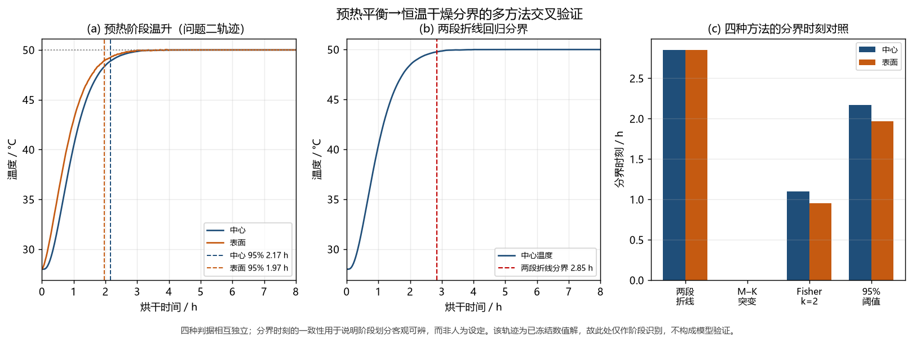

# 12　多方法交叉验证

无内部实测真值时，"检验"只能由**相互独立的方法对同一结论的交叉印证**构成；本章按 L1—L10 给出结果，容差**运行前预先声明**。

## 12.1　交叉验证架构

各层的原始输出与判定记录随源程序一并提供于支撑材料。

表 31 的完整内容见附录 C。

## 12.2　L1：时间积分器互换

同网格、同容差下仅换积分方法（BDF/NDF → 三阶 Radau IIA，另一积分族）：

表 33 的完整内容见附录 C。

**结论**：两积分族在三档网格上事件微秒级一致 ⇒ 时长不是积分器的产物。

## 12.3　L2：湿分面离散格式的必要性

调和平均在 $N=1600$ 仍与 Kirchhoff 相差 $8.759\times10^{-3}$ h（问题二三）、$1.211\times10^{-3}$ h（问题四），而 Kirchhoff 由 $N=400$ 到 1600 只变 $1.09\times10^{-4}$ h；故生产格式已收敛、替代格式不可用（表 32）。

## 12.4　L5：收缩效应的独立尺度互验

等效定半径时间 131.6198 h 与直接模拟 129.8452 h 相差 **1.3667%**（预声明容差 5%；式 (67)）。

## 12.5　L6：三阶段分界

四种独立判据的分界（h）：

表 34 的完整内容见附录 C。

**诚实结论**：
> 环境、半径与计算温度序列**都是渐变的，不存在统计意义上的突变点**（Mann–Kendall 检验 UF/UB 曲线在置信带内不相交），故**分界只能以区间报告**（图 11 为判据位置与 UF/UB 曲线）。

{width=13.0cm}

## 12.6　方法学提醒：注入类实验必须自带哨兵

敏感性实验中修正了两处"看似跑两套方法、实际只跑一套"的真实缺陷：

1. **替代通量从未被调用**：对照脚本内部自建模型实例，使"先建实例再替换其方法"**不生效**，"两法完全一致（差 0.0）"实为未调用；修正：加 `fluxPathUsed` 守卫，失效即抛错。
2. **参数注入失效**：Kirchhoff 分支内部面通量用**硬编码的扩散系数前因子**、**不读取物性函数返回的 $D$ 数组**，"只缩放 $D$"不改变模型，筛选结果呈现"$D$ 影响恰为 0"的假象；修正：对返回通量直接乘尺度因子（Kirchhoff 面通量对 $D_0$ 严格线性）并加 $scale=1.0$ 基准自检。

> **方法学结论**：**注入类实验必须先验证"注入确实生效"**，否则"参数无影响"会被误读为稳健性（与 12.3 节同属一类风险）。

## 12.7　交叉验证小结

> 达标时间由两个积分族与两种湿面离散格式互验且三档网格一致，阈值事件根差 $5.8\times10^{-11}$ s，收缩缩短效应经 $R^{2}$ 尺度折算互验到 1.37%，三阶段分界由四判据交叉识别落于同一区间。**故 57.4724 h 与 51.0906 h 不是特定网格、求解器或判据的产物。**

---

# 13　灵敏度分析与不确定性

## 13.1　不确定性的来源分类

三类不确定性分别报告，**不混为一谈**：**数值**（网格、时间推进、阈值插值、容差）见 10.9 节；**情景**（环境延拓、$C_{eq}$、$h$ 与 $\beta$、潜热、端面）见 13.2—13.6；**参数**（扩散前因子、导热系数、尾段温度）见 13.3。

> **边界声明**：本题**无内部实测真值**，上述区间**都是情景范围或设置差异，不是统计置信区间，也不是实测误差**。

## 13.2　环境延拓的不确定性

报告时间落在附件 1 观测窗（4 h）外的比例：问题三 **93.04%**（57.4724 h 中 53.4724 h 无观测）、问题四 **92.17%**（51.0906 h 中 47.0906 h 无观测）。

4 h 末点（50.165 °C / 0.04986）与平台（50 °C / 0.05）间有 −0.165 °C / +0.00014 拼接跳变，$t=14400$ s 处**分段求解**使其数值可见，平台仍为假设 A05。**尾段温度情景**：49 °C 使问题二三临界时间 **+3.25%**、51 °C 使 **−3.11%**，属**物理输入情景敏感性**，**不是统计误差条**。

## 13.3　参数不确定性与"传质控制"结论

**口径说明**：本表为 $N=200$ **代理网格**，与正式网格（$N=3200/6400$）事件时间差 1.65 s（问题二三），**只用于排序与相对幅度**；$scale=1.00$ 处已自检复现代理基准到 $10^{-6}$ h。

**表 35　参数扫描结果（$N=200$ 代理网格，仅用于排序与相对幅度）**

| 扩散前因子尺度 | 问题二三事件 /h | 问题四事件 /h |
|---:|---:|---:|
| 0.70 | 79.4187 | 70.4059 |
| 0.875 | 64.7520 | 57.5214 |
| **1.00（基准）** | **57.4728** | **51.0910** |
| 1.05 | 55.0567 | 48.9526 |
| 1.225 | 48.1888 | 42.8615 |
| 1.40 | 43.0796 | 38.3160 |

跨度：问题二三 **36.34 h（63.2%）**，问题四 **32.09 h（62.8%）**。

| 导热系数尺度 | 问题二三事件 /h | 问题四事件 /h |
|---:|---:|---:|
| 0.85 | 57.4752 | 51.0941 |
| 0.925 | 57.4739 | 51.0924 |
| **1.00（基准）** | **57.4728** | **51.0910** |
| 1.075 | 57.4718 | 51.0898 |
| 1.15 | 57.4710 | 51.0887 |

跨度：问题二三仅 **0.00418 h（0.0073%）**，问题四仅 **0.00535 h（0.0105%）**。

> 本工况下模型是**传质控制**的：扩散前因子 $-$30%/+40% 使达标时间变化约 +38%/−25%，导热系数 ±15% 的影响不到万分之一。

**Morris 筛选（仅排序）**：最敏感三参数为尾段温度、表面潜热比例、$\beta$（$\mu^{*}$=7.36、2.96、2.44 h/单位）；**其 $d_{\text{scale}}$ 条目必须作废**（见 12.6 节），$D$、$k$ 结论以表 33 的**带自检单参数扫描**为准。
## 13.4　物理闭合的情景包络

潜热未计入时 $L\in\{0,0.25,0.5,1\}$ 包络（表 27）使问题二三 +0—5.26%、问题四 +0—10.56%；气固平衡未闭合（隐含 $a_w\equiv1$）时数据锚定的 $p$ 族包络（表 28）使问题二三 +0—13.87%、问题四 +0—8.27%；两者同向指向真实时长**更长**。

**结论**：两缺口**同向**，均指向真实时长不小于 57.4724 h / 51.0906 h，故二者写作**本模型族下界**恰当；但**不能**把区间相加当作总区间。

## 13.5　传热传质系数与端面效应

**（a）$h$ 与 $\beta$**：沿用 $h=25$ W/(m²·K)、$\beta=8\times10^{-7}$ m/s（A07），已各作 ±10%、±20% 情景计算，**报告为设置差异而非实测误差**；$\beta$ 敏感度远高于 $h$，与"传质控制"一致。

**（b）端面效应**：$L/(2R_0)=6.25$ 是一维径向近似的依据之一，但 $R_0/L=0.08$ **不是** 8% 的误差上界；二维轴对称对照给出 $R^{2}$ 退化回归残差 $3.46\times10^{-18}$、端面对临界时间影响 7.6089 s（$60\times60$ 网格），仅支持"本组参数与输出量下影响较小"，**不能**推广为"所有时刻与位置均可忽略"。

**（c）辐射（仅量级核对，不进入模型）**：按"壁温等于气温 50 °C、表面 28 °C、发射率 0.9、等温黑环境全包围"假设，辐射换热系数 6.216461327 W/(m²·K)，辐射与对流热流之比 24.87%。**该结果完全依赖上述壁温与发射率假设，是情景参数而不是实测值**；题目明确 $h=25$ W/(m²·K) 为对流换热系数，本文**不声称其已包含辐射**，也未求解含辐射的 PDE，**不能把该通量比当作时长误差**。

## 13.6　数值精度限制的如实记录

四位小数只是**展示口径**而非精度声明（10.11 节）；问题三四的最坏差统计于"21 个固定半径 × 整数秒/60 s"的**公共采样点**，**不是连续全域的严格上界**（问题四真实表面 $x=1$ 处差更大）；系数保护下限**不裁剪状态变量**，本轨迹最小含水率远高于该下限而未被激活；本文不构造成 $\partial(BT)/\partial t$ 形式，**故不出现"能量守恒检验通过"**。

## 13.7　待解释口径汇总

**表 36　七个待解释口径及其处理状态**

| 编号 | 问题 | 本文的处理 | 状态 |
|---|---|---|---|
| U01 | 烘房 kg/kg 的参考质量基准与材料平衡含水率的映射未明 | 按假设 A04 显式约定，并在 11.5 节构造数据锚定的吸附族 | 阻塞"无条件实测准确性"的声明 |
| U02 | 附件 1 仅 4 h，而全过程 2—3 天 | 按 50 °C/0.05 平台延拓，并对照末值/末段均值/扰动（13.2 节） | 无假设不能唯一预测 4 h 之后 |
| U03 | `result2.xlsx` 的终止时刻未在题面明确 | 保留至问题三达标后的复核秒（206902 s），另导出前 3 h | 不影响求解 |
| U04 | 问题四半径不落在 0.1 cm 格点时表面与域外如何表达 | 固定物理距离列 + 独立"药材表面"列；域外留空 | 已在 `result4.xlsx` 实现 |
| U05 | 题给 $\rho(C)$ 与严格干物质守恒不自动相容 | 有效热容量与干骨架守恒分开处理（11.1 节） | 阻塞"全部严格守恒"的说法 |
| U06 | 问题四若达标超过 72 h 则半径数据不足 | 本次 51.09 h < 72 h，**未使用外推** | 不触发 |
| U07 | "严格低于 0.15"与四位显示 0.1500 的冲突 | 报告连续穿越时刻、严格达标的首个输出时刻与未舍入 max $C$ | 不阻塞，已保留未舍入证据 |

## 13.8　本节"不能声称"清单

- **不能**给出实测预测准确率、RMSE 或烘干时间置信区间（无内部实测数据），也**不能**声称连续时空的严格误差界（现有为有限采样口径的比较）；
- **不能**把所有四位小数的末位都称为稳定；
- **不能**声称完整的多相物理已闭合（气固平衡、潜热、密度—体积相容均未闭合）；
- **不能**把情景范围写成置信区间，也不能把参数情景写成实测误差。

---

# 14　结论

本文建立圆柱形中药材热风烘干的轴对称一维径向热湿耦合模型（守恒有限体积、Kirchhoff 浓度势、隐式变阶变步长积分、解析 Jacobian）。

**问题一**　常热物性下预热 1800 s 时表面/中心温度 **36.7856 °C**/**33.5753 °C**，表面含水率降至 **1.5102 kg/kg**、距中心 1 cm 内基本不变；热与水分 Fourier 数之比约 34，温升远快于水分迁移（解析解对照偏差 $1.80\times10^{-6}$ K）。

**问题二**　附录 3 物性下温度约 2 h 趋于环境值，3 h 时表面 **49.9664 °C**、径向温差仅 **0.1169 °C**，而含水率梯度仍显著（中心 1.7662、表面 1.0081 kg/kg）⇒ 预热后进入内部水分扩散控制的**恒温干燥阶段**。

**问题三**　以空间最大含水率严格低于 0.15 kg/kg 为判据，固定半径下需 **57.4724 h（约 2.39 天）**，落在题目 2—3 天周期内；达标由药材**中心**控制（报告时刻中心未舍入 0.1499999、表面 0.0527 kg/kg），事件由 ODE 事件与独立二分求根给出、相差 $5.8\times10^{-11}$ s。

**问题四**　计入附件 2 半径收缩并用附录 4 物性后需 **51.0906 h（约 2.13 天）**，报告时刻半径收缩至 1.2000 cm、未用 72 h 之后的外推；同物性对照表明收缩使达标时间由约 **129.85 h** 缩短至约 **51.09 h**（约 **60.7%**），并经独立 $(R_0/R)^{2}$ 尺度折算印证到 **1.37%** 以内。问题三、四同时改变物性与几何，时长差不能全归因于收缩。

**模型的修正与创新**　① 题给 $\rho(C)$、半径轨迹、固定长度与严格干物质守恒不能同时精确成立，给出热物性闭合（必要性半径界 1.2112 cm）；② 表面汽化耗能以潜热比例包络处理（$L=1$：问题二三 +5.26%、问题四 +10.56%）；③ 以 Kirchhoff 浓度势处理强非线性水分通量（调和平均在 $N=1600$ 仍偏离 $8.8\times10^{-3}$ h）；④ 以材料坐标与干骨架守恒处理移动边界；⑤ 由附件 1 反推平台相对湿度 0.607，得锚点 $a_w(0.05)=0.607$，构造吸附闭合族（$p=4$：+13.87%／+8.27%）。

**稳健性与不确定性**　达标时间在两个积分族与两种湿面离散格式下于三档网格一致到 $10^{-6}$ s 量级，收缩效应与三阶段分界分别经尺度折算和四判据互验；本工况为**传质控制**（扩散前因子 $-30\%/+40\%$ 使时长变化约 $+38\%/-25\%$，导热系数 $\pm15\%$ 影响不到万分之一）。无内部实测数据，故本文为**所列假设下的条件性预测**、两个报告时长是闭合族**下界**，不作准确率或置信区间声明；报告时长中 92%—93% 落在环境观测窗之外。

**可推广方向**　① 二维轴对称以显式处理端面；② 引入吸附/解吸等温线与表面蒸发能量平衡闭合气固界面；③ 以"变长度 + 变半径"骨架守恒替换同比收缩假设；④ 接工艺优化（品质约束下最小化能耗或时长）。

---

---

# AI 工具使用声明

本参赛队在竞赛过程中使用了 AI 工具，主要用于资料与规则核对、公式与代码复核、数值验证脚本编写、文稿一致性与格式检查，详细使用情况见支撑材料。

本参赛队对所提交作品的原创性、真实性和准确性负全部责任。本文的核心模型选择、关键闭合假设（等效平衡映射、有效显热容量、同比径向收缩）与最终数值结论均由本参赛队确定；AI 参与完成的公式、代码与文字内容已逐项人工审查与核实，凡与题目给定条件或计算结果不符者已予修改或弃用。用于支撑本文结论的全部源程序、输入数据、运行记录与校验证据一并提供于支撑材料。

---

---

# 参考文献

[1] 2026 年高教社杯全国大学生数学建模竞赛 A 题：药材的烘干问题[Z]. 2026.（含附件 1、附件 2、附件 3、附录 2—4）

[2] COMSOL. Heat Transfer Theory[EB/OL]. [2026-09-12]. https://doc.comsol.com/6.3/doc/com.comsol.help.comsol/comsol_ref_heattransfer.30.25.html

[3] FAO. Crop Drying（Chapter 9: Moisture Content / Drying Theory）[EB/OL]. [2026-09-12]. https://www.fao.org/4/s1250e/S1250E0u.htm

[4] COMSOL. Diffusion Coefficient[EB/OL]. [2026-09-12]. https://www.comsol.com/multiphysics/diffusion-coefficient

[5] COMSOL. How to Model Heat and Moisture Transport in Porous Media[EB/OL]. [2026-09-12]. https://www.comsol.com/blogs/how-to-model-heat-and-moisture-transport-in-porous-media-with-comsol

[6] COMSOL. Deformed Meshes[EB/OL]. [2026-09-12]. https://doc.comsol.com/6.3/doc/com.comsol.help.comsol/comsol_ref_deformedmeshes.34.04.html

[7] ASHRAE. ASHRAE Handbook—Fundamentals, Chapter 1: Psychrometrics[EB/OL]. [2026-09-12]. https://handbook.ashrae.org/Handbooks/F25/SI/F25_Ch01/F25_Ch01_si.aspx

[8] Virtanen P, Gommers R, Oliphant T E, et al. SciPy 1.0: fundamental algorithms for scientific computing in Python[J]. Nature Methods, 2020, 17(3): 261-272.

[9] SciPy. scipy.integrate.solve_ivp[EB/OL]. [2026-09-12]. https://docs.scipy.org/doc/scipy/reference/generated/scipy.integrate.solve_ivp.html

[10] NIST. NIST Digital Library of Mathematical Functions（指数积分与 Bessel 函数章节）[EB/OL]. [2026-09-12]. https://dlmf.nist.gov/

[11] MathWorks. ode15s：Solve stiff differential equations and DAEs[EB/OL]. [2026-09-12]. https://www.mathworks.com/help/matlab/ref/ode15s.html

[12] 杨世铭, 陶文铨. 传热学[M]. 4 版. 北京: 高等教育出版社, 2006.

[13] Crank J. The Mathematics of Diffusion[M]. 2nd ed. Oxford: Clarendon Press, 1975.

[14] Carslaw H S, Jaeger J C. Conduction of Heat in Solids[M]. 2nd ed. Oxford: Oxford University Press, 1959.

**正文引用位置对照**

| 文献 | 正文引用位置 |
|---|---|
| [1] | 1.1、1.2、第 3.1 节（数据来源）、第 5.7 节（题给经验式） |
| [2] | 5.3.1（傅里叶定律）、5.4.1（热方程） |
| [3] | 5.1.2（干基/湿基定义）、5.7.4(a)（比热容加权形式） |
| [4] | 5.3.2（扩散系数与 Arrhenius 关系） |
| [5] | 5.6.4（气固界面与相变）、11.2（潜热闭合） |
| [6] | 5.5（材料坐标与移动网格） |
| [7] | 5.6.4（含湿量 ↔ 蒸汽分压换算）、11.5（式 (68)） |
| [8] [9] | 10.3.1（BDF/NDF 与刚性 ODE 求解） |
| [10] | 10.2.3（指数积分 $\mathrm{Ei}$）、10.4（Bessel 函数） |
| [11] | 10.4 检验五（MATLAB 独立交叉核验） |
| [12] | 2.3（Biot 数）、5.8（无量纲数） |
| [13] | 5.4.2（圆柱内扩散） |
| [14] | 10.4 检验一（圆柱 Bessel 级数解） |

---
